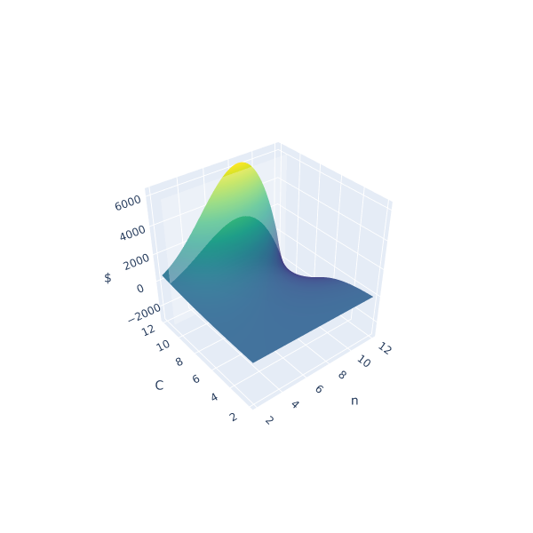

```text
compounder
```

This is just some filler text for this post before I clean it up. I just wanted
to be able to post something to keep myself accountable for posting somewhat
frequently.

The problem this post lays out is the idea of compound interest with a
twist. The twist is that every time you decide to compound, you must suffer a
penalty taken from your balance. You might think this problem is contrived out
of thin air but it actually exists in the world of cryptocurrencies. Some tokens
out there allow you to "stake" your token and be given a reward/dividend for
doing so. Some tokens however require you to "claim" your rewards to be added to
your balance, however the act of doing so means you must send a "transaction"
which costs fees from your balance. So the natural question arrives as to what
is the optimal times you should compound so you can profit from compound
interest but not be eaten away by fees by compounding too frequently.

Lets talk abstractly for a moment and lay some ground terms.

-   $n$ - number of compounds per year
-   $P$ - initial balance
-   $f$ - fee per compound
-   $r$ - APY

This will be our base layer before we start adding more concepts ontop.

First we will define compound interest

$$\begin{alignedat}{2}
 P {\left(\frac{r}{n} + 1\right)}^{n}
 \end{alignedat}$$

Now we can add on the idea of iterative penalties which is the summation
of fees across every compounding instance (known as $n$)

$$\begin{alignedat}{2}
 f {\sum_{i=0}^{n - 1} {\left(\frac{r}{n} + 1\right)}^{i}}
 \end{alignedat}$$

By subtracting the two ideas we can get the expression

$$\begin{alignedat}{2}
 P {\left(\frac{r}{n} + 1\right)}^{n} - f {\sum_{i=0}^{n - 1} {\left(\frac{r}{n} + 1\right)}^{i}} = P {\left(\frac{r}{n} + 1\right)}^{n} - \frac{{\left(n \left(\frac{n + r}{n}\right)^{n} - n\right)} f}{r}
 \end{alignedat}$$

Now lets pause and try to intuitively think about this expression and what it
means. If we compound $n \rightarrow \infin$ we will end up with a $-\infin$
amount of money due to the right hand component blowing up. If we compound at
least 1 time (since $n=0$ is undefined), it is not hard to see how under the
right circumstances we could have increased $n$ such that we could have earned
more. This is a poor explanation and there is a better proof to describe this
but take my word that under the right circumstances there is an optimum from
compounding between 1 and infinity. To understand where this maximum is we need
to understand this function a little deeper.

To learn a little more about the 'shape' of this function, lets unify all the
paramaters we can't 'control' under some var $C$ and plot what we have left in 3D.

$$\begin{alignedat}{2}
 -n \left(\frac{C + n}{n}\right)^{n} + C {\left(\frac{C}{n} + 1\right)}^{n} + n
 \end{alignedat}$$



The interesting thing we can see here is that if we hold the variables we can't
control constant and slice the space with a plane (shown by the slightly opaque
vertical plane) we see that there is an optimal number of compounds that gives
us the highest yield. And if we minimize this function we can get our optimal
number of compounds

If we look at the opaque plane cross section we see that it forms something that
looks like a parabola. This "parabola" like shape holds (for reasons I won't
explain) for all constraints of the paramaters meaning that we will always find
a maximum for this function that lies in the first quadrant.

The next most natural question to ask is how does this strategy perform compared
to a naive one? To check how performant we are to a naive strategy (like
compounding once a month/week/day) we must first track based on time (how long
until we compound) do we earn. To do this with our derived formula we can look
at this

$$\begin{alignedat}{2}
 P_{n} = {P_{n-1}} + \frac{{P_{n-1}} r}{{\rm ciwip}\left({P_{n-1}}, f, r\right)}
 \end{alignedat}$$

We'll stop here for now but take a guess on how much extra performance we can
squeeze out compared to the naive compounding strategy.
