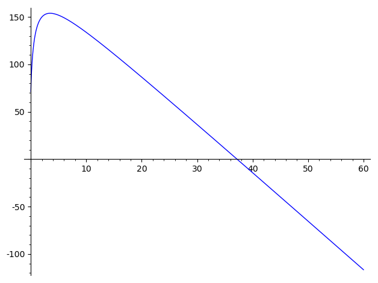

## Cryptocurrency dividends? 🤔

Most people who are "in the know" of the cryptocurrency world have probobaly
heard of the various ways to make a return from their tokens. People can deposit
their tokens via staking, lending, or Liquidity Pools and sit back to earn
additional tokens, increasing their portfolios value. This is starkly different
from the norm which is HODLing tokens and waiting for their prices to increase.

If these earners continually invest their returns back into these earning
protocols, they benefit from the :sparkles:magic:sparkles: that is compound
interest. Unfortunately most cryptocurrency/blockchain projects are pay to play,
meaning that if you want to interact with any of these earning protocols, you
need to spend tokens to make tokens. This begs the question: what's the most
efficent way to spend the least amount of tokens too make the most returns?

## DONE Abstracting the earning process

There are many methods to earn "dividends" from cryptocurrency. However most
earning protocols expose the same metrics which we will use to our advantage. To
start, we will lay out the following paramaters for the earning process:

-   $n$ - Number of compounds per year
-   $P$ - Initial balance
-   $r$ - APY
-   $f$ - Fee per compound

The following paramaters give us the foundation of compound interest.

$$\begin{alignedat}{2}
 P {\left(\frac{r}{n} + 1\right)}^{n}
 \end{alignedat}$$

While this is all well and good, we want to account for the fact that whenever
we want to "compound" our pending earnings, we need pay a fee to do so. With
this in mind we need to come up with an expression to account for each
penalization fee $f$ over each compounding instance
$n$.

To do this we will add on the idea of iterative penalties which is the summation
of fees across every compounding instance.

$$\begin{alignedat}{2}
 f {\sum_{i=0}^{n - 1} {\left(\frac{r}{n} + 1\right)}^{i}}
 \end{alignedat}$$

By subtracting the two ideas we can get the expression

$$\begin{alignedat}{2}
 P {\left(\frac{r}{n} + 1\right)}^{n} - f {\sum_{i=0}^{n - 1} {\left(\frac{r}{n} + 1\right)}^{i}}
 \end{alignedat}$$

Simplifying we can get the function

$$\begin{alignedat}{2}
 {\rm ciwip}\left(P, f, r, n\right) = P {\left(\frac{r}{n} + 1\right)}^{n} - \frac{{\left(n \left(\frac{n + r}{n}\right)^{n} - n\right)} f}{r}
 \end{alignedat}$$

Now lets pause and try to intuitively think about this expression and what it
means. If we compound $n \rightarrow +\infty$ we will end up with
a $+\infty$ amount of money due to the right hand
component blowing up. This also makes sense as we will be paying the fee an
infinite amount of times. If we compound at least 1 time (since
$n = 0$ is undefined), it is not hard to see
how under the right circumstances we could have increased $n$ such that we
could have earned more. This is a poor explanation and there is a better proof
to describe this but take my word that under the right circumstances there is an
optimum from compounding between 1 and infinity. To understand where this
maximum is we need to understand this function a little deeper.

To learn a little more about the 'shape' of this function, lets unify all the
paramaters we can't 'control' under some var $C$ and plot what we have left in
3D.

$$\begin{alignedat}{2}
 -n \left(\frac{C + n}{n}\right)^{n} + C {\left(\frac{C}{n} + 1\right)}^{n} + n
 \end{alignedat}$$

The interesting thing we can see here is that if we hold the variables we can't
control constant and slice the space with a plane (shown by the slightly opaque
vertical plane) we see that there is an optimal number of compounds that gives
us the highest yield. And if we minimize this function we can get our optimal
number of compounds

If we look at the opaque plane cross section we see that it forms something that
looks convex. This means that we will be able to find an optimal number of
compounds to give us an optimal reward. Here is what the opaque plane looks like
graphed

Something interesting to note is that if we can perform a bit of limit analysis
on the derivative of this function, we can see that the slope of this function
reaches a constant value.

$$\begin{alignedat}{2}
 \lim\limits_{ n \rightarrow +\infty } \frac{\partial}{\partial n}{\rm ciwip}\left(P, f, r, n\right) = -\frac{f e^{r} - f}{r}
 \end{alignedat}$$

In order to find out if this function is truley convex, we can leverage Jensen's
inequality to check if the inequality is true.

$$

\begin{CD}
  g( \alpha x + ( 1 - \alpha ) y ) \geq \alpha g( x ) + ( 1 - \alpha ) g( y )
\end{CD}

$$

With this inequality we can plug in our function $c$ and check this inequality
evaluated at $0$ and $c(n)=P$, the reason we choose these bounds is because

$$\begin{alignedat}{2}
 3 \, P {\left({\alpha} - 1\right)} - 3 \, {\left(P {\left({\alpha} - 1\right)} - \left(1 \times 10^{-08}\right) \, {\alpha}\right)} \left(\frac{P {\left({\alpha} - 1\right)} - \left(1 \times 10^{-08}\right) \, {\alpha} - 1}{P {\left({\alpha} - 1\right)} - \left(1 \times 10^{-08}\right) \, {\alpha}}\right)^{-P {\left({\alpha} - 1\right)} + \left(1 \times 10^{-08}\right) \, {\alpha}} - \left(3.0000000000000004 \times 10^{-08}\right) \, {\alpha} - 70 \, {\left(-\frac{1}{P {\left({\alpha} - 1\right)} - \left(1 \times 10^{-08}\right) \, {\alpha}} + 1\right)}^{-P {\left({\alpha} - 1\right)} + \left(1 \times 10^{-08}\right) \, {\alpha}} \geq -{\left(3 \, P \left(\frac{P + 1}{P}\right)^{P} - 3 \, P - 70 \, {\left(\frac{1}{P} + 1\right)}^{P}\right)} {\left({\alpha} - 1\right)} - 70.0000128944777 \, {\alpha}
 \end{alignedat}$$

Now it might not look like it, but graphing both sides of this inequality shows
that this expression is true for $0 \lt \alpha \lt 1$ meaning that this function
IS convex.
