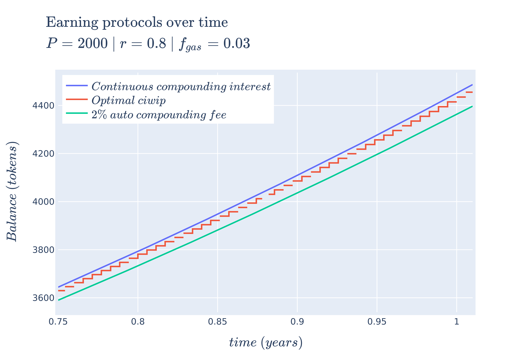

## Cryptocurrency "dividends"? 🤔

Most people who are "in the know" of the cryptocurrency/defi world have probably
heard of the various ways to earn "dividends" from their holdings. By leveraging
earning protocols such as staking, lending, or by being a liquidity provider,
people can just sit back and accrue tokens, increasing their portfolio's
value. This is starkly different from the norm, which is to HODL until the price
of their assets hits the moon.

Unlike those who strictly HODL, earners that continually invest their returns
back into earning protocols benefit from the :sparkles:magic:sparkles: that is
compound interest.

Unfortunately, since most cryptocurrency/blockchain projects are pay to play
(due to gas fees), every time an earner wants to interact with an earning
protocol, they need to pay a fee to do so. In short: You need to spend tokens to
make tokens ...

This begs the question: How do we spend the least to make the most with respect
to these earning protocols and compound interest?

## Abstracting earning protocols

There are many methods to earn "dividends" from cryptocurrency; however, most
fall into one of two types:

1.  Auto compounding
2.  Manual compounding

Auto compounding earning protocols will compound frequently and automatically,
but usually do so for a percentage fee of your earnings. Manual compounding
earning protocols, instead, require **you** to compound your own earnings, only
having to pay for gas fees.

Despite both flavors, they both intend for you to follow the same steps:

1.  Deposit tokens into the earning protocol
2.  Wait for "dividends" to accrue
3.  Receive/claim "dividends"

It might seem obvious at first just to choose the auto compounding type as it's
simpler and easier, but just because it seems obvious **does not** mean it's the
most profitable.

Instead of blindly following this procedure, let's take a closer look at both of
these types of earning protocols and see if we can come up with an expression to
model potential earnings. This will allow us to better understand the
differences between both types and be better informed before investing in one of
them.

To start, let's abstract out some overarching parameters (since most earning
protocols can be modeled similarly to one another).

-   $t$ - Time until each
    compound (in years)
-   $n$ - Number of
    compounds per year
-   $P$ - Initial balance
-   $r$ - APR
-   ${f_{gas}}$ - Fee per
    compound

> **Aside** - We will assume, in the manual compounding case, that every time earnings
> are "claimed," they are automatically reinvested back into the protocol,
> effectively making it a compounding process.

## Modeling auto compounding

Although most auto compounding earning protocols charge a fee, they have the
nice added benefit of zero interaction. We can sit back and stack tokens knowing
everything is managed for us. Predicting our future earnings in this category is
simple as we can model future earnings with the compound interest formula (with
some modifications):

$$

\begin{alignedat}{2}
P {\left(-\frac{{f_{perc}}}{n} + \frac{r}{n} + 1\right)}^{n t}
\end{alignedat}

$$

As long as we take into account the percentage fee and APR, calculating future
earnings is simple and direct.

## Modeling manual compounding

Manual compounding earning protocols are more nuanced when calculating potential
earnings than their auto counterparts (and are the primary focus of this
post). Since we compound at our own schedule, we get to choose how fast or slow
we want to do so. The obvious next question to ask is, "what is the best
compounding schedule?" But before we get there, let's start from square one and
create an expression to model earnings after compounding just once:

$$

\begin{alignedat}{2}
P_{0} r t + P_{0} - {f_{gas}} = P_{1}
\end{alignedat}

$$

This is our base case where $P_{0}$ is our
initial balance and $P_{1}$ is our
balance after compounding. Now the obvious next question is what does this
expression look like if we compound again? Compounding for a second time means
we follow the same formula as before, except we substitute our second balance
with our balance **after** the first compound. We will also assume our compounding
schedule is at a constant rate, represented by time
$t$ between compounds. This can be described as follows:

$$

\begin{alignedat}{2}
P_{0} r t + P_{0} - {f_{gas}} = P_{1} \\ P_{1} r t + P_{1} - {f_{gas}} = P_{2} \\ P_{0} r^{2} t^{2} + {\left(2 \, P_{0} - {f_{gas}}\right)} r t + P_{0} - 2 \, {f_{gas}} = P_{2}
\end{alignedat}

$$

Now if we want to compound many times, we can define our future balance
${P_n}$ recursively as
follows:

$$

\begin{alignedat}{2}
P_{0} r t + P_{0} - {f_{gas}} = P_{1} \\ {P_{n-1}} r t + {P_{n-1}} - {f_{gas}} = {P_n}
\end{alignedat}

$$

This recursive definition is great! But it would be nicer (and simpler to
compute) if we had a closed form expression. Backing up to the
$n = 2$ case, if we
re-arrange a few of the terms, and substitute
$t = \frac{1}{n}$, we can start to see a familiar formula appear:

$$

\begin{alignedat}{2}
{\left(P_{0} r t + P_{0} - {f_{gas}}\right)} r t + P_{0} r t + P_{0} - 2 \, {f_{gas}} \\ {\left(r t + 1\right)}^{2} P_{0} - {f_{gas}} r t - 2 \, {f_{gas}} \\ P_{0} {\left(\left(\frac{1}{2} \, r\right) + 1\right)}^{2} - \frac{1}{2} \, {f_{gas}} r - 2 \, {f_{gas}}
\end{alignedat}

$$

Looking closely at the final expression, we can see that the leftmost component
looks eerily like compound interest. That's because it is! And if we compare the
formula for compound interest against this term we can see that there is a
direct comparison that will be embedded for every positive
$n$.

$$

\begin{alignedat}{2}
P {\left(\frac{r}{n} + 1\right)}^{n}
\end{alignedat}

$$

Now this is all well and good, but there are additional terms we aren't
accounting for related to the fees that are paid each compounding. This can be
expressed via the idea of iterative penalties which is the summation of fees
subtracted from each compounding instance.

$$

\begin{alignedat}{2}
{f_{gas}} {\sum_{i=0}^{n - 1} {\left(\frac{r}{n} + 1\right)}^{i}}
\end{alignedat}

$$

By subtracting the iterative penalty fees from compound interest, we get the
following expression which is equivalent to our recursive definition:

$$

\begin{alignedat}{2}
P {\left(\frac{r}{n} + 1\right)}^{n} - {f_{gas}} {\sum_{i=0}^{n - 1} {\left(\frac{r}{n} + 1\right)}^{i}}
\end{alignedat}

$$

Simplifying iterative penalties as a geometric series, we arrive at our final
function, compound interest with iterative penalties (or
$ciwip$).

$$

\begin{alignedat}{2}
{\rm ciwip}\left(P, r, {f_{gas}}, n\right) = P {\left(\frac{r}{n} + 1\right)}^{n} - \frac{{\left(n \left(\frac{n + r}{n}\right)^{n} - n\right)} {f_{gas}}}{r}
\end{alignedat}

$$

With this expression we can now model the behavior of a manual compounding
earning protocol with a compounding schedule of
$n$. With this model, let's try to gain some insight into how
they work with some visualizations. This will allow us to understand them better
before we find the best schedule.

## Understanding via visualization 📈

It seems most reasonable to start with a 2D plot dependent on
$n$ because it's the
only parameter that we can control once we put in a deposit. Holding all the
other parameters constant using some arbitrary values, we get the following
plot:

With this 2D view we can now get a better understanding of what optimal
compounding really means.

The first intuition we can take away is that as we tend $n \rightarrow +\infty$ we see that our output value tends towards negative
infinity meaning we lose more than we are gaining (which we don't
want). However, there is an inflection point (around $n = 2.79$) where we make **more** than we lose. This means that by compounding at
the right frequency, the accrued rewards are greater than the fees we need to
pay to claim them.

Now we can return to our original question: "how do we spend the least to make
the most?". The answer we can infer from this plot for manual compounding is
"choose the optimal $n$".

> **Aside** - Something interesting to note is that as we tend
> $n \rightarrow +\infty$ it looks like our function starts
> to become linear. We can prove this by taking the limit of the derivative of our
> function. We can see it's independent of
> $n$ meaning that even though compounding to infinity
> means we will keep losing, we will eventually lose at a constant rate.
>
> $$
>
> \begin{alignedat}{2}
> \lim\limits_{ n \rightarrow +\infty } \frac{\partial}{\partial n}{\rm ciwip}\left(P, r, {f_{gas}}, n\right) = -\frac{{f_{gas}} e^{r} - {f_{gas}}}{r}
> \end{alignedat}
>
> $$

### Homogenization

For the example above we used fixed parameters, but what if we changed them to
be higher or lower? How would our plot change? Would we still see the same
shape? To learn a little more about the shape of this function, let's unify all
the parameters we can't control under some var
and plot what we have left in 3D.

Doing so will give us the following expression:

$$

\begin{alignedat}{2}
-n \left(\frac{C + n}{n}\right)^{n} + C {\left(\frac{C}{n} + 1\right)}^{n} + n
\end{alignedat}

$$

Visualizing this expression gives us the following plot:

The interesting thing we can observe is that if we hold the variables we can't
control constant (via $$) and represent some
choice
$C$ by slicing the space with a plane (shown by the slightly
opaque vertical plane), the corresponding cross section is the space of possible
results of our balance as a consequence of choosing some
$n$. Looking closely, there seems to be a similar shape between
the intersection and the 2D plot, and if we slide the opaque plane up and down
the $C$ axis, the shape
seems consistent. However, this empirical observation doesn't prove
anything. Instead, in search of our optimal $n$,
let's explore some of the mathematical properties of our problem.

## In search of optimality ⛰

We showed in the previous section that when we chose some fixed parameters for
our
function, there was an optimal  that
enables us to earn more than we lose. This is obviously an ideal case which we
want to happen all the time!  Unfortunately, in reality, our "fixed" parameters
aren't so "fixed" and fees and APRs can change by the second. What we really
want to know is: for any reasonable set of parameters, can we find the optimal
number of compounds that gets us a balance greater than what we started with?

### Using the gradient

One initial approach we can take is to use the gradient. If we find where the
gradient is equal to zero, then we can find the extrema of our function which
will allow us to find our inflection point and optimal number of
compounds. Unfortunately, this isn't really tractable so we will need to find
another way.

$$

\begin{alignedat}{2}
-P {\left(\frac{r}{n} + 1\right)}^{n} {\left(\frac{r}{n {\left(\frac{r}{n} + 1\right)}} - \log\left(\frac{r}{n} + 1\right)\right)} + \frac{{\left({\left(\frac{n^{2} {\left(\frac{n + r}{n^{2}} - \frac{1}{n}\right)}}{n + r} - \log\left(\frac{n + r}{n}\right)\right)} n \left(\frac{n + r}{n}\right)^{n} - \left(\frac{n + r}{n}\right)^{n} + 1\right)} {f_{gas}}}{r} = \frac{\partial}{\partial n}{\rm ciwip}\left(P, r, {f_{gas}}, n\right)
\end{alignedat}

$$

### Avoiding losses

Another direction we can take is to simplify our problem by finding all the
places where we lose more than we gain, and ignoring them.

We know that the space of possible compounds is from $0 \rightarrow +\infty$ and we've already
established that as we compound more and more we get diminishing returns, and
eventually substantial losses. To avoid these losses, we need to see where
${\rm ciwip}\left(P, r, {f_{gas}}, n\right) < P$. We can observe from our 2D
graph of $ciwip$ that
$P$ is intersected twice,
first at $0$ and second at
$n = 20.0$. Now based on what we know about this function, it makes sense that
there will always be two points where ${\rm ciwip}\left(P, r, {f_{gas}}, n\right) = P$, one when we don't compound at
all, and one when we are compounding too much to the point where we end up "net
even." This second "net even" point is important because with it we can show
that compounding beyond it will always lead to losses. To find this point we can
take ${\rm ciwip}\left(P, r, {f_{gas}}, n\right) = P$, and simply solve for
$n$. Doing so gets us the
expression.

$$

\begin{alignedat}{2}
n = \frac{P r}{{f_{gas}}}
\end{alignedat}

$$

This means all we need to do is show that if we compound beyond this "net even"
point with some positive ${\epsilon}$, we will
always get less than our initial balance $P$. If we put
this into an expression, we get:

$$

\begin{alignedat}{2}
{\rm ciwip}\left(P, r, {f_{gas}}, {\epsilon} + \frac{P r}{{f_{gas}}}\right) < P
\end{alignedat}

$$

And if we follow the substitution and replacement we get the expression:

$$

\begin{alignedat}{2}
\left(-\frac{{\epsilon} {f_{gas}}}{r}\right) {\left(\left(\frac{{\epsilon} {f_{gas}} + {\left(P + {f_{gas}}\right)} r}{{\epsilon} {f_{gas}} + P r}\right)^{{\epsilon} + \frac{P r}{{f_{gas}}}} - 1\right)} < 0
\end{alignedat}

$$

This expression will always hold true as long as all the components are positive
real values (which we've already established is true in the framing of our
problem). This is due to the fact that the left hand component will always be
negative, and the right hand component will always be positive. This means the
result will always be negative.

This allows us to conclude that compounding greater than ${\epsilon} + \frac{P r}{{f_{gas}}}$ for any
${\epsilon} > 0$ we will always end up with less than
our original balance.

Now we know that our optimal value must lie in between
$0$ and $\frac{P r}{{f_{gas}}}$, let's try to see if we will always be able to find this
optimal point.

### Concavity

Now that we know our optimal value is bounded, instead of trying to find a
closed form way of getting the maximum of our function, maybe we can search for
it. The only problem we have now is how do we know our optimal value is easily
findable? Luckily there is a property we can try to prove about our function to
make finding it easier. The most ideal property we would want to prove is
concavity.

If we can show that our function is concave, then we will know two important things:

1.  All local maxima are global maxima
2.  An optimizer will find a local maxima

In order to find out if this function is truly concave, we can leverage [Jensen's
inequality](https://en.wikipedia.org/wiki/Jensen%27s_inequality) and check if it is true in all cases.

$$

\begin{alignedat}{2}
g\left({\lambda} x_{1} + x_{2} {\left| {\lambda} - 1 \right|}\right) > {\lambda} g\left(x_{1}\right) + {\left| {\lambda} - 1 \right|} g\left(x_{2}\right)
\end{alignedat}

$$

If we substitute our function into Jensen's inequality and supply our bounds
(ignoring everything but the $n$ parameter) we get:

$$

\begin{alignedat}{2}
{\rm ciwip}\left(\frac{P r {\left| {\lambda} - 1 \right|}}{{f_{gas}}}\right) > {\lambda} {\rm ciwip}\left(0\right) + {\left| {\lambda} - 1 \right|} {\rm ciwip}\left(\frac{P r}{{f_{gas}}}\right)
\end{alignedat}

$$

Substituting further and reducing we get the expression:

$$

\begin{alignedat}{2}
-{\left(P {\left| {\lambda} - 1 \right|} - P\right)} {\left(\left(\frac{P {\left| {\lambda} - 1 \right|} + {f_{gas}}}{P {\left| {\lambda} - 1 \right|}}\right)^{\frac{P r {\left| {\lambda} - 1 \right|}}{{f_{gas}}}} - 1\right)} > 0
\end{alignedat}

$$

This final inequality will tell us if our function
$ciwip$ is concave or not. It may not seem like it right away but
this inequality will always be true if our components are positive real
values. Let's break down this expression a bit more to see why.

First let's decompose the left hand side of our expression into two components
${\alpha}$ and
${\beta}$ as follows:

$$

\begin{alignedat}{2}
-P {\left| {\lambda} - 1 \right|} + P = {\alpha} \\ \left(\frac{P {\left| {\lambda} - 1 \right|} + {f_{gas}}}{P {\left| {\lambda} - 1 \right|}}\right)^{\frac{P r {\left| {\lambda} - 1 \right|}}{{f_{gas}}}} - 1 = {\beta} \\ {\alpha} {\beta} > 0
\end{alignedat}

$$

Looking at our decomposition we can first observe that
${\alpha} > 0$ because $P > P {\left| {\lambda} - 1 \right|}$.

We can also infer that ${\beta} > 0$.

Since
$P {\left| {\lambda} - 1 \right|} + {f_{gas}} > P {\left| {\lambda} - 1 \right|}$, we know the base of the exponent is greater than 1. We also
know that any number greater than 1 raised to a positive power will also be
greater than 1. This means that ${\beta}$ must be
positive.

Now that we have inferred that ${\alpha}$ and
${\beta}$ are both
positive we can finally affirm that ${\alpha} {\beta} > 0$ must also be true!

Finally, since we have shown that ${\alpha} {\beta} > 0$ must be true, we have shown that Jensen's inequality must
always be true, and that our function is always concave. Knowing this, and being
paired with the knowledge of a bound on our search space, we can reframe our
formula as an optimization problem:

$$

\begin{alignedat}{2}
\argmax_{ {n^\prime} \isin \mathbb{Z}^+ < \frac{P r}{{f_{gas}}} } {\rm ciwip}\left(P, r, {f_{gas}}, {n^\prime}\right) = {P_{n^\prime}}
\end{alignedat}

$$

In this framing, ${n^\prime}$ represents
our optimal $n$ and since we know our
problem is convex, we know we will always find it. Using our optimal
${n^\prime}$ allows us
now to predict future earnings for $ciwip$ with
the optimal compounding schedule.

> **Aside** - You will notice that we are optimizing
> ${n^\prime}$ over the integers and not real values. We have to do
> this as there is no way we can compound a "fractional" number of times. However,
> we can do this and preserve concavity (from [section 3.2.2 of Stephen Boyd's
> convex optimization book](https://web.stanford.edu/~boyd/cvxbook/bv_cvxbook.pdf)) if we say the integers are a "subset" of the reals.

## Compare and contrast

Now that we have an expression to predict future earnings for optimal
$ciwip$, which models
manual compounding earning protocols, and an expression for auto compounding
earning protocols, let's see how they compare against one another with some
hand-picked parameters:

The interesting thing to take away from this plot is that given the following
set of parameters, manual compounding via optimal
$ciwip$ performs better than the auto compounding counterpart
(with continuous compound interest performing the best). This means that if we
were to assume, at the start, that auto compounding earning protocols were
better and invested in them, we could be missing out on potential profits by not
using optimal $ciwip$. However, if
we increased the gas fee, our auto compounding variety would perform better (we
will save the theory for which scenarios cause one to perform better over the
other for another post).

Armed with the tools to model earnings for both compounding types, we can now
make an informed decision about maximizing our profits.

## Future directions

Despite the depth of this post in exploring earning protocols, we only scratched
the surface as there are plenty of potentially interesting areas to explore:

1.  Statistically representing earning protocol parameters:

    As mentioned earlier in this post, fees and APRs can change by the second
    based on a myriad of factors. If we were to represent these parameters as
    distributions, how would our compounding schedule or future earnings change?
    How could we use outside knowledge to update our hypotheses about this
    problem?

2.  Earning protocol rebalancing strategies:

    There are many earning protocols to choose from. How should we associate risk
    with them? When do we leave one for another? Where do we redirect streams of
    earnings?

## Conclusion

The world of defi and cryptocurrency continues to fascinate me as new economic
experiments and protocols get launched every day. Despite the negative press, I
truly believe these experiments will yield novel results and change the way we
move value between one another. It also could all go to zero, but I'll enjoy the
ride either way.

I hope you enjoyed and learned something new 🖐
