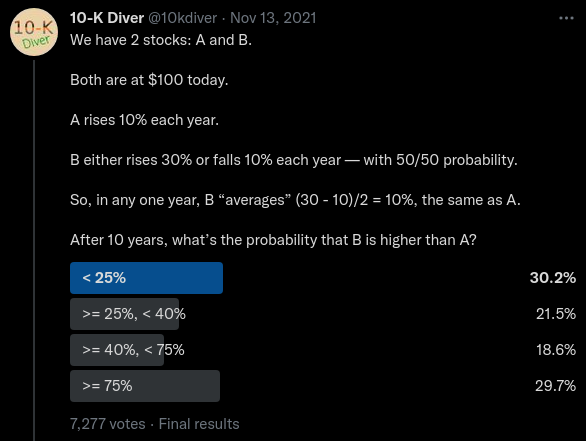
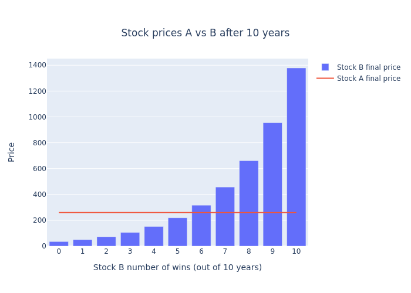
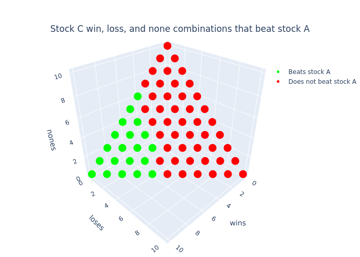

## The puzzle

Last year I attended a multi lecture series "Math Explorations" at [MoMath](https://momath.org/)
hosted by [Steven Strogatz](https://www.stevenstrogatz.com/). During the final lecture, Steve showed us this
[interesting tweet](https://twitter.com/10kdiver/status/1459494549919703041) by the creator known as `@10kdiver`. I encourage you to take
a stab at the puzzle! Keep in mind the highlighted answer is the highest voted
and not necessarily the right answer.




## The solution

Attacking this puzzle **seems** simple at first glance, but has an interesting
non-intuitive line of probabilistic reasoning (as most probability puzzles do)
that will get us the answer. In order to work towards the solution, lets start
by formalize everything we know starting with stock A.

Stock A has predictable returns, meaning we can easily calculate the future
price (represented as ${a_{10}}$) as follows:

$$\begin{alignedat}{2}
 {a_{0}} = 100 \\ {a_{1}} = 1.1 \, {a_{0}} \\ ... \\ {a_{10}} = 1.1 \, {a_{9}} \\ {a_{10}} = 259.37
 \end{alignedat}$$

It's safe to conclude that Stock A is awesome! It gets us over 2.5x our
initial investment after 10 years guaranteed!

Stock B on the other hand isn't so clean cut as it's depends on how "lucky" we
are and how many "wins" and "losses" occur. Without thinking about "luck" or
probability, let's create an expression for stock B's future price
parameterized on a single win:

$$\begin{alignedat}{2}
 r_{n} \isin \text{\textbraceleft} 0, 1 \text{\textbraceright} \\ {b_{0}} = 100 \\ {b_{n-1}} {\left(1.3 \, r_{n} + 0.9 \, {\left(-r_{n} + 1\right)}\right)} = b_{n}
 \end{alignedat}$$

For reference, $r_{n}$ represents
the result of a single year (1 or 0 meaning "win" or "lose") at year
$n$.
$b_{n}$ represents the price of B at year
$n$. But we can simplify this recursive definition of stock B's
price into a singular formula based on the number of wins and losses after
$10$ years.

$$\begin{alignedat}{2}
 100 \cdot 1.3^{w} 0.9^{l} = {b_{10}}
 \end{alignedat}$$

Now that we have the tooling to calculate stock A and stock B's future price,
the next step is to figure out in what scenarios does stock B overtake A. It's
clear to see that after 10 years, stock B can reach multiple prices. For
example, if stock B "wins" 9 years out of the 10, the future price can be
calculated as:

$$\begin{alignedat}{2}
 100 \cdot 0.9^{1} \cdot 1.3^{9} = 954.4
 \end{alignedat}$$

Wawaweewa! This is almost 10x our initial investment! Albeit rare as there are
only a few ways to "win" 9 times.

Stock B _could_ also "lose" 9 years out of 10, which results in a price of:

$$\begin{alignedat}{2}
 100 \cdot 0.9^{9} \cdot 1.3^{1} = 50.36
 \end{alignedat}$$

Boooo! We lose almost half of our investment! But just like our first scenario
this is also rare as there are few ways to "lose" 9 times.

The next question we should ask ourselves is how many "wins" will it take for
stock B to overtake stock A? To get the answer, we can use our previous price
formulation of stock B, set it equal to stock A's final price and solve for
the number of "wins" it will take for B to equal A:

$$\begin{alignedat}{2}
 100 \cdot 1.3^{w} 0.9^{-w + 10} = 259.37
 \end{alignedat}$$

Simplifying and solving we get:

$$\begin{alignedat}{2}
 100 \cdot 1.3^{w} 0.9^{-w + 10} = 259.37 \\ \log\left(\frac{34.87 \cdot 1.3^{w}}{0.9^{w}}\right) = 5.56 \\ 5.46 = w
 \end{alignedat}$$

Now we know that after $5.46$
wins, stock B will overtake stock A. But this doesn't make sense. We don't
have a way to define what a "partial" win means. To remedy this we **must**
round up to the nearest number of wins because we are only interested in where
stock B "beats" stock A.

Let's get a better understanding by visualizing this "overtake":



By looking at this graph we can see that stock B only starts "beating" stock A
once it gets 6 wins or more.

Moving forward, knowing that we need **at least** 6 wins, we can now
start to narrow in on our final answer by asking the next natural question,
"what are the odds of winning 6 or more times". The initial urge one might say
would be to perform a "sum" like so $0.5 ^ 6 + 0.5 ^ 7 + 0.5 ^ 8 + 0.5 ^ 9 +
  0.5 ^ {10} = 0.03$, but this is a **mistake**! With this result we are instead
answering the question "What is the sum of probabilities of a **sequence** of
$6,7,8,9,10$ wins/losses?" Instead the underlying question we **really** want to
answer is "Out of **all** the possible sequences of wins/losses, what is the
probability of B getting 6 wins or more?"

To answer this analytically, we need to think in terms of combinatorics! Our
answer will come to us if we determine the count of **all winning** sequences
divided by **all possible** sequences. We can formulate this idea by using the
formula "n choose k" (commonly known as the binomial coefficient formula), sum
up all the ways to make $6, 7, 8, 9, 10$ wins, then divide by the number of
all possible sequences of "wins" and "losses":

$$\begin{alignedat}{2}
 \frac{k! n!}{\left(-k + n\right)!} = {n \choose k} \\ 2^{- 10} \sum_{i=6}^{10} {\binom{10}{i}} = 0.38
 \end{alignedat}$$

So
$0.38$ or ">= 25%, < 40%" is our final answer!

What I find most interesting about this puzzle is that most peoples "gut"
answer is no where close to the actual answer. The puzzle definitely puts into
perspective the non intuitive results of calculated probabilities vs "gut"
probability.


## Extra credit: Stock C

Now that we solved the two stocks probability puzzle, let's extend the puzzle
to make it more interesting! Call it "extra credit" 😂.

This extension was not covered by 10K Diver and is my personal contribution
to the puzzle:

> Along with stock A and B, we now introduce stock C.
>
> Stock C is very similar to stock B, except alongside the possibilities of a
> "win" or a "lose", there is an additional equal chance of a "none" year
> occurring, meaning no loss or gain.
>
> Overall Stock C has an equal chance of rising 30%, falling 10%, or
> staying the same.
>
> After 10 years, what's the probability that C is higher than A?
>
> What about C being higher than B?

Take a stab at this extension to the puzzle and continue reading for the answers.

---

At first one might think that we need a whole different approach to getting
the solution, but we can actually just build on top of the tooling we already
used to solve the original puzzle.

The first piece we need to understand is that the formula for stock C is no
different than that of stock B, it's just a change of constraints.

$$\begin{alignedat}{2}
 100 \cdot 1.3^{w} 1^{-l - w + 10} 0.9^{l} = c_{10} \\ N + l + w = 10
 \end{alignedat}$$

**Note**: We are using $N$ instead of $n$ to indicate the
number of "none" years.

If we look at the formula for the future price for stock C above, we can see
that it's equivalent to stock B (because multiplying anything by 1 keeps the
result the same)! However, this doesn't mean that stock C is equivalent
overall to stock B. Unlike stock B, the second formula underneath is the
constraint that stock C must have satisfied **before** calculating price.

Building on top of this new information, the next piece we need to understand
is how many possible future prices can stock C reach after 10 years? We know
that stock A has only 1 possible future price and stock B has 11, but what
about stock C?

This can be easily calculated via combinations with replacement (aka multiset
binomial coefficients). We can do this by representing stock C's final prices as
unique "objects", and years be represented as "sample size" (combinatorially
speaking):

$$\begin{alignedat}{2}
 o = 3 \\ r = 10 \\ {\rm nCr}\left(o, r\right) = \frac{\left(o + r - 1\right)!}{\left(o - 1\right)! r!} \\ {\rm nCr}\left(o, r\right) = 66
 \end{alignedat}$$

We can now see that stock C has
$66$ potential future prices, woweee! But how many of those
future prices beat stock A?

To get a better understanding when stock C beats stock A, let's plot all the
combinations of wins, losses, and nones, then color the situations where stock
C beats stock A.



In this plot every point is a particular combination (or multiset) of "wins",
"losses", and "nones" colored to indicate which final prices "beat" stock
A. It's quite clear to see that there are more final prices that result in
stock C losing to stock A. At this point, one might think that the answer is
just the ratio between the number of dots that are green divided by the total
number of dots (which is
$\frac{20}{66} = 0.303$). Unfortunately this **isn't** the right
answer. We need to remember (from the first part of this puzzle) that we need
to take into account all the possible _ways_ we can reach these final prices
opposed to **just** looking at final prices. To count the number **ways** to reach
these final prices, we will build on top of the previous tool we used (the
binomial coefficient formula) with its natural extension: the _trinomial_
coefficient formula 🤓📐!

$$\begin{alignedat}{2}
 \dbinom{n}{i, j, k} = \frac{n!}{i! j! k!}
 \end{alignedat}$$

With this _new_ tool, we can now determine the number of **ways** stock C can
beat stock A and compare that against the total number of **ways** stock C can
reach any final price. Pulling this all together with some summations and a
piecewise function we can express our final answer as follows:

$$\begin{alignedat}{2}
 \frac{\sum_{\substack{0 \leq w \leq 10\\\\0 \leq l \leq 10 - w}} \begin{cases} \frac{10!}{l! w! \left(- l - w + 10\right)!} & \text{for}\: 100 \cdot 0.9^{l} 1.3^{w} \geq 259.37 \\\\0 & \text{otherwise} \end{cases}}{\sum_{\substack{0 \leq w \leq 10\\\\0 \leq l \leq 10 - w}} \frac{10!}{l! w! \left(- l - w + 10\right)!}}
 \end{alignedat}$$

This expression is pretty daunting, so let's break it down.

1.  Each summation iterates across all possible "wins" and "losses" that
    satisfy stock C's constraint. We don't need to explicitly iterate by
    $N$ because we can
    calculate it from $w$ and
    $l$.
2.  The denominator is summing up **all** the possible ways stock C can reach any
    of its final prices.
3.  The numerator is summing up **only** the number ways stock C beats stock A

Performing this computation gets us a final result of
$0.19$ 😮. To put this into context, that's **half** as much as
stock B! What a terrible investment opportunity!

The interesting insight to take away here is that just because we added a new
**seemingly** innocuous outcome (adapting stock B to stock C), doesn't mean an
innocuous change in results.


## Verification via Monte Carlo

So far we have done all of our probability calculations analytically (using
just formulas and algebra). Another way to calculate the answers to these
puzzles is to use Monte Carlo simulation!

> Monte Carlo methods, or Monte Carlo experiments, are a broad class of
> computational algorithms that rely on repeated random sampling to obtain
> numerical results. The underlying concept is to use randomness to solve
> problems that might be deterministic in principle
>
> -- Wikipedia

In simpler terms, the Monte Carlo methodology is used when we just want to
throw a computer at a statistical problem, and get an approximate answer. So
by throwing some Monte Carlo at our puzzle (via some Python / Numpy) we get
the following results:

```python
import numpy as np

stock_B = np.vectorize(
    lambda sample: \
    start_price * \
    (b_perc_win ** (sample == 0).sum()) * \
    (b_perc_lose ** (sample == 1).sum()),
    signature="(n)->()"
)
stock_C = np.vectorize(
    lambda sample: \
    start_price * \
    (b_perc_win ** (sample == 0).sum()) * \
    (b_perc_lose ** (sample == 1).sum()) * \
    (1.0 ** (sample == 2).sum()),
    signature="(n)->()"
)

samples, years = 10_000, total_years
stock_A_samples = (start_price * a_perc**total_years)
stock_B_samples = np.apply_along_axis(stock_B, 1, np.random.randint(0, 2, size=[samples,years]))
stock_C_samples = np.apply_along_axis(stock_C, 1, np.random.randint(0, 3, size=[samples,years]))

print("B > A:", (stock_B_samples > stock_A_samples).mean().round(2))
print("C > A:", (stock_C_samples > stock_A_samples).mean().round(2))
print("C > B:", (stock_C_samples > stock_B_samples).mean().round(2))
```

```text
B > A: 0.38
C > A: 0.19
C > B: 0.36
```

And BABAM! Our Monte Carlo simulations have verified our first two answers
**and** gave us an approximate answer for our third! See if you can find an
analytical solution to the probability of stock C beating stock B!


## Conclusion

Why is this puzzle worth talking about?

What makes this puzzle special is that right out of the gate you are prompted
with a contradiction, namely that both stocks "average" the same. At first
this is just confusing, but it's secretly a hint! The puzzle is essentially
telling you "**don't** think in averages, try something else!"

I usually don't like puzzles that give you hints right away, but this one is
an exception. It's hidden in plane sight and it's the first thing your brain
gravitates too.

One of the most beautiful things I love about puzzles like these (and
statistics in general) is how innately unintuitive they can be. Often times
our gut instinct is starkly different than the real solution and thats **OKAY**!
When I first saw this puzzle/tweet from Steve my first and second gut answers
were wrong! Only after being given a hint from Steve to "think
combinatorially" did I start to realize how to approach and solve it.

Thanks for getting this far down statistics boulevard 🎊, let me know what you
think of this post in the comments below!
