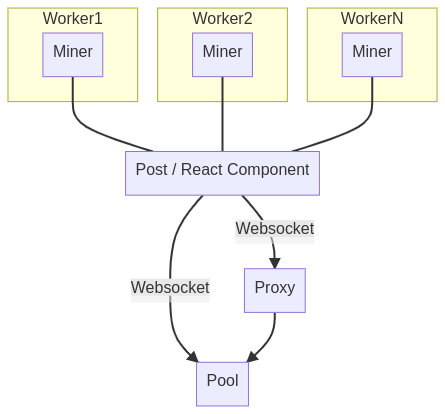

<Miner running={true} />

<WalletState preText="This post has made " />

Thanks for coming by!

If the box above shows "running" then congratulations! You are actively mining
cryptocurrency and contributing to the proof of work consensus algorithm!

If you have no idea what that means, then don't worry about it! Just know that
keeping this tab open supports me in writing more content online. 💞

For those of you that *do* know what this means, you are most likely thinking
"how is this even possible?"

You might have a lot of questions right now so I'm going to try and
pre-emptively answer as many as I can. If I leave anything out, feel free to
tell me at [alex@taoa.io](mailto:alex@taoa.io).

## What is this post about?

An intro to how cryptocurrency mining works, and how to do it in the browser.

## How did you make this?

Webassembly and a little crypto knowledge (I'll elaborate on this later 👇).

## Isn't this crypto-jacking?

Kinda not really. Crypto-jacking implies I'm trying to actively steal your CPU
power, instead I'm enabling you to donate your CPU power as a way to support an
up and coming creator!

## Is the $ this post has made up to date?

It should be! Come back in a few days to see what the current revenue generated
by this post is!

## How does this post "mine crypto"?

This is a bit of a big question so I'm going to break it down into smaller
pieces.

## How does mining work?

Cryptocurrency mining has been around for so long and been written about so
much, the internet can explain it better than I ever could.

Here are some top notch links that explain mining on a deeper level:

- [https://monerodocs.org/proof-of-work/pow-in-cryptocurrencies/](https://monerodocs.org/proof-of-work/pow-in-cryptocurrencies/)
- [https://andersbrownworth.com/blockchain/](https://andersbrownworth.com/blockchain/)
- [https://ethereum.org/en/developers/docs/consensus-mechanisms/pow/](https://ethereum.org/en/developers/docs/consensus-mechanisms/pow/)
- [https://academy.bit2me.com/en/que-algoritmo-mineria-randomx-monero](https://academy.bit2me.com/en/que-algoritmo-mineria-randomx-monero)

If you don't wanna read this material, than just know that mining is the process
of many computers competing to solve math puzzles. A puzzle is "solved" when a
miner finds (by iteration) a special number (called a "nonce"), that when hashed
(alongside a bunch of other data) meets some "solution" criteria (which is
usually just some leading number of zeros in the hash output).

On any given day billions of computers compete to solve these puzzles and are
incentivized with a cryptocurrency reward (which has become quite valuable to
many). It's important to understand that this reward (called the "coinbase"
transaction) only goes to one address. This means that finding a solution is
binary (you either find it or you don't) and that this system is a "winner takes
all" competition.

Unfortunately this puts those who only have a few computers at a disadvantage
because more compute means more chances to "win" this competition.

Luckily all hope isn't lost to those who have little compute but want some of the
reward.

Enter pool mining.

## How does pool mining work?

Pool mining is simply the "pooling" or aggregation of compute resources from
many miners in an effort to be competitive in solving these math puzzles.

In fact, it's very hard (and expensive) to solve these puzzles quickly as a
"solo miner", and nowadays almost all mining is done in pools.

The interesting thing about mining pools is even though the proof of work system
is a "one winner takes all" competition, miners are incentivized to participate
because any rewards the pool recieves are split amongst its participants.

Instead of pool miners putting their personal wallet address in the coinbase
transaction, they put the mining pools address (this prevents miners from
scamming the pool). Miners then "prove" to the pool (which is usually a
centralized service), that they have found "partial" solutions (called shares)
and get paid according to the shares that they have submitted.

The work to reward ratio depends on the pool. You can also get into the weeds
about different payout methods like [PPS, FPPS, PPS+, and
PPLNS](https://minebest.com/blog/pps-vs-fpps-vs-pplns-vs-pps-mining-pool-payouts-explained),
but it's unnecessary. Just know that they are all based on getting paid from how
much "work" you've contributed.

## How does this post actually mine?

Alright, enough with the cryptocurrency theory and definitions. Let's break down
how this post mines piece, by piece.

## Piece 1: The browser miner

The miner is the heart beat of the entire proof of work system, it's the part
that actually "does" the computing and create hashes in an attempt to solve the
puzzles. Every cryptocurrency uses slightly different algorithms to make this
possible so implementations are cryptocurrency-specific.

The mining algorithm used in the background of this post is called
[Cryptonight](https://monerodocs.org/proof-of-work/cryptonight/) and the mining
pool this post is a part of ([monero ocean](https://moneroocean.stream/))
rewards us in Monero (XMR).

> FYI: The latest version/fork of Monero uses a new algorithm called RandomX,
> but Cryptonight is easier on desktop computers (which is most likely where
> you're viewing this post from).

Browser mining is not new. Its been implemented and reimplemented multiple
times, and instead of reimplementing Cryptonight and an entire browser miner, I
merged the best parts of multiple implementations in one place:

- [https://github.com/notgiven688/webminerpool](https://github.com/notgiven688/webminerpool) (and it's many forks)
- [https://github.com/JayWalker512/CryptoNoter](https://github.com/JayWalker512/CryptoNoter)
- [https://github.com/howardchung/jsminer](https://github.com/howardchung/jsminer)

Once this page loads, a webworker+miner is run per core available (via
`window.navigator.hardwareConcurrency`). Shares are then actively computed in a
WASM compiled implementation of Cryptonight ([compiled from
here](https://github.com/notgiven688/webminerpool/blob/master/hash_cn/libhash/main.c))
and sent to the pool.

Check out the code [here](https://github.com/cmrfrd/taoa/blob/development/src/components/Miner/Miner.tsx).

## Piece 2: Connecting to the pool

Most mining pools communicate via the
"[stratum](https://en.bitcoinwiki.org/wiki/Stratum_mining_protocol)" protocol
(which is just glorified JSON over a tcp socket).

But fortunately, some pools support communication over websockets making
communication from the browser much easier to build!

This post connects to the pool via websockets and proxies solved shares from the
workers, directly to the pool. An intermediary nginx proxy (running on
[fly.io](fly.io)) is used just in case the browser blocks the pool address 😉.

Heres a little diagram of the whole setup:

## Piece 3: Seeing rewards

Monero transactions are
"[private](https://www.getmonero.org/get-started/what-is-monero/)" by
default. This means that any Monero sent to an
[address](https://monerodocs.org/public-address/standard-address/) has a
"hidden" amount, sender, and reciever. All of which is secured via advanced
cryptography (specifically via [Ring
Signatures](https://www.getmonero.org/resources/moneropedia/ringsignatures.html)).

Even though Monero wallets are private, we can still publish our wallet balance.

This is because every Monero wallet comes with two sets of keys, one for
spending and one for viewing. By publishing our wallet address and view key, our
balance can be transparent to the public which is great for an application like
this!

Here is the wallet and view key for your viewing convenience:

<WalletInfo />

## Why did you do this?

Because it's cool!

On a serious level though I built this so I could understand pool mining and
Cryptonight at a deeper level (and potentially make some money while doing it
💰)!

I also wanted to experiment with the idea of using mining as an alternative
monitization method to ads, even though [it's been
shown](https://ifip.byu.edu/2019/DRW2019_paper_23.pdf) to be a rather inferior
method.

Cryptocurrency is quite a spectacular technology and I believe we've only
scratched the surface of what we can do with it. So much of it is unknown and
despite what people say, no one knows what it means!

Thanks for reading! ʕ•ᴥ•ʔ
