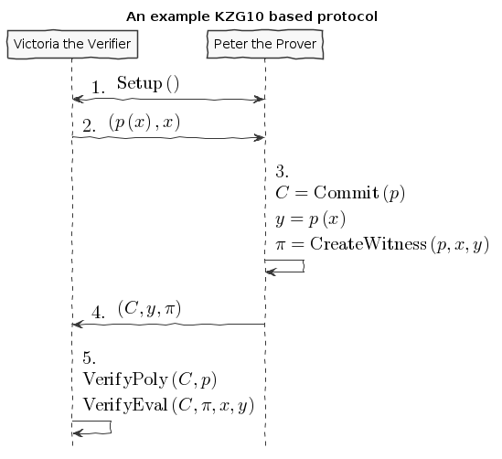

## What is a Cryptographic Commitment?

Making a cryptographic commitment is like making a promise. It enables us to
"commit" to some statement and prove later that we were abiding by it. The
ones receiving the commitment can also trust that it's cryptographically hard
to lie without being caught.

More formally, the two security properties we need are:

1.  **Binding:** Two different statement can't make the same commitment
2.  **Hiding:** Given a commitment, nothing is known about the statement

If you want to learn more about these properties, I've written about [hash
based commitment schemes](https://taoa.io/posts/Committing-to-lunch) that goes into more detail.

## Polynomial Commitment Scheme (PCS)

There are many different styles of commitments. What makes PCS's unique is that
instead of committing and verifying a "statement" (a.k.a just a blob of data),
we are verifying a polynomial. This might not seem so special at first glance,
but in PCS's we get the additional utility of verifying polynomial evaluations!

In essence, this allows us to do verifiable computation on a polynomial
without re-doing the evaluation ourselves.

## KZG10 PCS

There are many extraordinary PCS's like [FRI](https://drops.dagstuhl.de/opus/volltexte/2018/9018/pdf/LIPIcs-ICALP-2018-14.pdf) or [IPA](https://eprint.iacr.org/2017/1066.pdf) (used in bulletproofs), but
[KZG10](https://cacr.uwaterloo.ca/techreports/2010/cacr2010-10.pdf) has a few unique features compared to other schemes:

1.  It's [pairing](https://en.wikipedia.org/wiki/Pairing-based_cryptography) based
2.  Its proofs are constant in size (a single elliptic curve group element)
3.  Verification time is constant (two pairing operations)

This is awesome because when applying PCs to zero knowledge systems (like
[zkSNARKs](https://vitalik.ca/general/2021/01/26/snarks.html)), constant space and time is pretty neat! But it's not all sunshine
and rainbows as the largest tradeoff of KZG10 is that it requires a [trusted](https://zkproof.org/2021/06/30/setup-ceremonies/)
[setup](https://vitalik.ca/general/2022/03/14/trustedsetup.html).

## KZG10 as a protocol

Before implementing KZG10, let's understand it in the context of an example
protocol. Doing so will give us a base understanding of all its components and
how they fit together.

In this example protocol there will be two participants, **Victoria the
Verifier** who wants to outsource the computation of a polynomial, and **Peter
the Prover** who wants to evaluate the polynomial and show the evaluation is
correct. We will also assume that any messages sent between them become public
information.

This is a non standard protocol, but will serve its purpose in understanding
KZG10. We'll start at a high level diagram as follows:

Now this is a pretty dense representation so to break it down. Here is what
the variables, functions, and steps represent.

| Variable            | Description                                                                                             |
|---------------------|---------------------------------------------------------------------------------------------------------|
| $p\left(x\right)$   | The desired polynomial to be evaluated of the form $p\left(x\right) = {\sum_{{i}=0}^{n} c_{i} x^{{i}}}$ |
| $\left(x, y\right)$ | Point to be evaluated by $p$                                                                            |
| $C$                 | Committed representation of the polynomial $p\left(x\right)$                                            |
| ${\pi}$             | Proof of evaluation (not $3.14...$)                                                                     |

| Function        | Description                                                 |
|-----------------|-------------------------------------------------------------|
| $Setup$         | Sets up paramaters to be used for the rest of the protocol  |
| $Commit$        | Creates a "commitment" when given a polynomial              |
| $CreateWitness$ | Produces a proof of evaluation of $x$ on $p$                |
| $VerifyPoly$    | Checks that a commited polynomial and a polynomial coincide |
| $VerifyEval$    | Checks that a committed polynomial was evaluated properly   |

### Steps

1.  **Victoria the Verifier** sends the polynomial with an x coordinate to be
    evaluated at.
2.  **Peter the Prover** computes a commitment to the polynomial, the
    evaluation of the polynomial, and a proof of evaluation.
3.  **Peter the Prover** sends all the information to the **Victoria the
    Verifier**.
4.  The **Victoria Verifier** checks that the **Peter the Prover** has evaluated
    the polynomial properly and has committed to the correct polynomial.

Notice that at no point will **Victoria the Verifier** evaluate the polynomial!

### Security properties

To finish off describing this protocol, we need to address some security
properties that will help thwart cheating. These properties establish a level
of trust knowing that tampering and falsification will be hard:

1.  Polynomial commitment binding and hiding

    We touched on this idea in the beginning of this post. But for this
    protocol instead of applying binding and hiding to statements, we need to
    be sure they hold true for a polynomial.

2.  Evaluation binding

    This property means that different evaluations of the polynomial will
    result in different proofs. With this we should be able to correctly
    identify that only proper evaluations and proper proofs will coincide
    in $VerifyEval$.

3.  Correctness

    This property just means that our protocol works as expected. More
    formally: all commitments made by $Commit$ can be verified
    successfully by $VerifyPoly$ and all proofs made by
    $CreateWitness$ can be verified successfully by
    $VerifyEval$.

## The math behind KZG10

Now that we've explored how KZG10 works functionally, the only missing chunk
left to understand is the math and cryptography behind the functions. We will
mostly focus on correctness, but touch on some other security properties as
well.

### Trusted setups and the Common Reference String

The most important dependency that makes KZG10 work is the Common Reference
String (CRS). This is just a set of public parameters agreed upon in
$Setup$ that all participants use to compute and verify
commitments and proofs. At the end of the day the CRS is just a set of
elliptic curve points of the form:

$$\begin{aligned} g , g^{{\alpha}} , g^{\left({\alpha}^{2}\right)} , \ldots , g^{\left({\alpha}^{t}\right)} \end{aligned}
$$

What makes these points interesting is that ${\alpha}$ is an
unknown integer number (at least it's supposed to be).

Unlike in [ECC public key cryptography](https://cryptobook.nakov.com/asymmetric-key-ciphers/elliptic-curve-cryptography-ecc) where the key holder knows their
private and public key ( $\left({\alpha}, g^{{\alpha}}\right)$ respectively), in
KZG10 we have a bunch of "public keys" with an "unknown" private key. Even
though we don't know what mystical number ${\alpha}$ was used to
create these "public keys", we do know that each successive "public key" is
defined by another successive power of ${\alpha}$.

We will use this to our advantage when we start talking about evaluating
polynomials.

#### Why is the CRS secure?

Ensuring ${\alpha}$ is a secret is **very** important for the
security of KZG10. If we knew ${\alpha}$ then we could forge
commitments and proofs to our advantage (more on that later).

In order to make a CRS we could sample our own ${\alpha}$ and
just "not look" at what it is (which is commonly done for testing). But if
many people wanted to use it our sampled CRS, they would have to trust we
didn't look at ${\alpha}$ 😉. In practice, cryptographers
perform MPC ceremonies where many machines contribute randomness to
${\alpha}$ so no one can reconstruct it without collusion. The
process for generating a CRS through MPC ceremonies is a bit out of scope
for this post, but these resources by [Vitalik Buterin](https://vitalik.ca/general/2022/03/14/trustedsetup.html) and [Sean Bowe](https://eprint.iacr.org/2017/1050.pdf) are
great places to learn more.

But how do we know we can't just recover ${\alpha}$ from the
CRS?

We can see that, at most, breaking the CRS is as hard as [ECDLP](https://wstein.org/edu/2007/spring/ent/ent-html/node89.html) (since we can
just try solving for ${\alpha}$ in the second public parameter
$g^{{\alpha}}$). However the security of the CRS is usually
described by the [**q-SDH** and **q-SBDH** assumptions](https://ai.stanford.edu/~xb/eurocrypt04a/bbsigs.pdf). These assumptions boil
down to trying to find some number $c$ and EC points
$g^{\left(\frac{1}{{\alpha} + c}\right)}$ and/or $e\left(g_{2}, g_{2}\right)^{\left(\frac{1}{{\alpha} + c}\right)}$. But it's been shown that an adversary has a low
probability of doing so.

### Polynomial commitments as elliptic curve points

In order to create a commitment for a polynomial, we need something akin to
a "hash" like function to establish **hiding** and **binding**. We could just
use a hash function, but we wouldn't be able to do any useful math on the
output besides equality. This is where the CRS starts to become
valuable. Using the CRS and some EC arithmetic, we can evaluate a polynomial
$p\left(x\right)$ on the secret number ${\alpha}$, and get
an EC point out. Here's how:

$$\begin{aligned} {\rm Commit}\left(p\right) \\ g^{p\left({\alpha}\right)} =  \\ g^{{\sum_{{i}=0}^{n} {\alpha}^{{i}} c_{i}}} =  \\ g^{{\alpha}^{n} c_{n} + ... + {\alpha}^{2} c_{2} + {\alpha} c_{1} + c_{0}} =  \\ {\prod_{i=0}^{n} (g^{\alpha^{i}})^{c_i}} = \end{aligned}
$$

Notice that evaluating our polynomial on ${\alpha}$ is just the
elements of the CRS multiplied by our polynomial coefficients. By
progressively doing EC scalar multiplication and point addition we are
effectively evaluating our polynomial on ${\alpha}$ even though
we don't know what ${\alpha}$ is! 😲

Unfortunately we cannot commit to infinite degree polynomials. We are capped
by $t$ parameters in the CRS. But $t$ is
usually some wickedly high number which provides a lot of wiggle room (ex:
$2^{21}$ from Zcash's powers of tau ceremony).

An important vulnerability to be aware of is that if we know
${\alpha}$, we can easily break **binding** by finding two
polynomials that evaluate to the same point:

$$\begin{aligned} {\alpha} = 3 \\ p_{1}\left(x\right) = x^{3} + 10 \, x^{2} + 8 \, x + 6 \\ p_{2}\left(x\right) = 7 \, x^{2} + 19 \, x + 27 \\ g^{p_{1}\left({\alpha}\right)} = g^{p_{2}\left({\alpha}\right)} \\ g^{{\alpha}^{3} + 10 \, {\alpha}^{2} + 8 \, {\alpha} + 6} = g^{7 \, {\alpha}^{2} + 19 \, {\alpha} + 27} \\ g^{147} = g^{147} \end{aligned}
$$

Luckily we can rely on the **t-polyDH** assumption (an extension of **q-SDH**)
to help us establish **hiding** and **binding** and prevent this vulnerability.

### Proofs of evaluation

Now that we can commit to a polynomial, the next step is to evaluate it on a
known point and **prove** we did so by creating a proof/witness.

> **Aside:** A "proof" and "witness" have similar definitions and are used quite
> interchangeably. Yehuda Lindell provides a [great explanation](https://crypto.stackexchange.com/questions/95899/is-witness-and-proof-the-same-thing-when-talking-about-zero-knowledge-what) of the
> distinction between the two.
>
> The actual KZG10 paper uses the term "witness" but I believe "proof" is
> easier to understand.

Evaluation of a polynomial is easy, but proving we did so is not
obvious. Here is the underlying math for proof creation:

$$\begin{aligned} y = p\left(x\right) \\ {\pi} = {\rm CreateWitness}\left(p, x, y\right) \\ g^{\phi_{\alpha}\left(x\right)} =  \\ g^{\frac{p\left({\alpha}\right) - p\left(x\right)}{{\alpha} - x}} = \end{aligned}
$$

Since we don't know ${\alpha}$, we must first do polynomial
division between $p\left({\alpha}\right) - p\left(x\right)$ and
${\alpha} - x$, _then_ evaluate the resulting polynomial with
the CRS. We can also trust that there should be no remainder from this
division because all terms in $p\left({\alpha}\right) - p\left(x\right)$ are of the form ${\left({\alpha}^{i} - x^{i}\right)} c_{i}$
(this becomes important a little later).

### Verifying evaluations

The proof we've just generated doesn't look like much, but it encodes a lot
of useful information related to the commitment previously generated that we
will use verify its correctness.

But before we can understand how to verify evaluations, we need to talk about
the primary ingredient to verification, namely pairings.

#### Elliptic curve pairings

Elliptic curve pairings, or "pairings" for short (defined by the operator
$e$), are a beautiful yet extremely complicated
construction. They enable us to take two points on an elliptic curve
(usually in two different groups) and produce a new point in a third and
different group e.g. $e\left(g_{2}, g_{2}\right) = g_{t}$. The main advantage
of pairings are that they give us new tools to perform EC arithmetic. The
primary tool we care about is the bilinear property. Bilinearity gives us
the following equalities (and then some):

$$\begin{aligned} e\left(P^{a}, R\right) = e\left(P, R\right)^{a} \\
e\left(P, R^{b}\right) = e\left(P, R\right)^{b} \\
e\left(P^{a}, R^{b}\right) = e\left(P, R\right)^{a b} \\
e\left(P + Q, R\right) = e\left(P, R\right) e\left(Q, R\right) \\
e\left(P, Q + R\right) = e\left(P, Q\right) e\left(P, R\right) \end{aligned}
$$

Understanding how pairings work is a topic for another day, but here are
some resources if you're curious:

1.  [Exploring Elliptic Curve Pairings](https://vitalik.ca/general/2017/01/14/exploring_ecp.html)
2.  [BLS12-381 For The Rest Of Us](https://hackmd.io/@benjaminion/bls12-381)
3.  [An Introduction to Pairing-Based Cryptography](https://www.math.uwaterloo.ca/~ajmeneze/publications/pairings.pdf)
4.  [Pairings In Cryptography](https://www.youtube.com/watch?v=8WDOpzxpnTE)
5.  [Bilinear Pairings](https://crypto.stanford.edu/pbc/notes/ep/pairing.html)
6.  [Pairings for beginners](https://static1.squarespace.com/static/5fdbb09f31d71c1227082339/t/5ff394720493bd28278889c6/1609798774687/PairingsForBeginners.pdf)

#### Using bilinearity

Using this bilinear property of pairings we can now dissect and understand
the underlying equality behind verifying evaluations:

$$\begin{aligned} {\rm VerifyEval}\left(C, {\pi}, x, y\right) \\
e\left({\pi}, g^{{\alpha} - x}\right) = e\left(C g^{-y}, g\right) \\
e\left(g^{\frac{p\left({\alpha}\right) - p\left(x\right)}{{\alpha} - x}}, g^{{\alpha} - x}\right) = e\left(g^{-y + p\left({\alpha}\right)}, g\right) \\
e\left(g, g\right)^{p\left({\alpha}\right) - p\left(x\right)} = e\left(g, g\right)^{-y + p\left({\alpha}\right)} \\
e\left(g, g\right)^{-y + p\left({\alpha}\right)} = e\left(g, g\right)^{-y + p\left({\alpha}\right)} \end{aligned}
$$

Simply put, verification boils down to checking that two target group EC
points are equal. By doing this simplification and rearranging of terms, we
can confirm that both sides of this equality are computing the same
thing. However, to better understand [correctness and soundness](https://math.stackexchange.com/questions/485955/difference-between-soundness-and-correctness#:~:text=From%20a%20cryptography%20viewpoint%2C%20its,or%20more%20parties%20are%20dishonest.), let's dig
deeper into why this verification will fail when tampered with.

#### Trying to cheat verification

Let's say we want to cheat as the prover and produce a false value
${y'}$ that will pass the $VerifyEval$
test. The only way we can achieve this is by tampering with any and all of
$\left(C, y, {\pi}\right)$. We've already established that
tampering with $C$ is hard because of **binding**, so
instead we are left with $y$ and ${\pi}$.

We can also clearly see that since $y$ is composed within
${\pi}$, so they must be changed together.

If we try cheating with $y$, the naive approach is to choose
our desired false ${y'}$ value and change the
$p\left(x\right)$ term in ${\pi}$ to
${y'}$.

Fortunately for the verifier, this naive cheating method will most likely
result in the numerator of the proof $-{y'} + p\left({\alpha}\right)$ leaving a remainder when divided by ${\alpha} - x$.
This will result in a failed reconstruction of $-{y'} + p\left({\alpha}\right)$ by the verifier, and a failed equality check.

Instead we need to be smarter. To cheat _without_ detection we need to find
a ${y'}$ such that $-{y'} + p\left({\alpha}\right)$ is divisible by ${\alpha} - x$. Doing so will trick
the verifier in the left hand pairing evaluation of
$VerifyEval$ resulting in a bad reconstruction of
$-{y'} + p\left({\alpha}\right)$. This bad reconstruction would
seem "normal" to the verifier, but actually result in a false positive.

> **Aside:** We could try to find a ${y'}$ equal to
> $p\left({\alpha}\right)$ to cheat. But this would require us to
> break the **q-SDH** assumption.

Unfortunately for us, finding the right ${y'}$ to cheat is
not feasible. If we first observe that the terms of a correctly executed
proof numerator can be simplified like so:

$$\begin{aligned} p\left({\alpha}\right) - p\left(x\right) =  \\
{\sum_{{i}=0}^{n} {\alpha}^{{i}} c_{i}} - {\sum_{{i}=0}^{n} c_{i} x^{{i}}} =  \\
{\sum_{{i}=0}^{n} -{\left({\alpha}^{{i}} - x^{{i}}\right)} c_{i}} = \end{aligned}
$$

We see that the polynomial $p\left({\alpha}\right) - p\left(x\right)$
will always have a positive root at ${\alpha}$ and will always
be divisible by ${\alpha} - x$.

This puts us in a pickle because we can only construct polynomials of the
form $-{y'} + p\left({\alpha}\right)$. Since we can only use this
form, the [polynomial factor theorem](https://sharmaeklavya2.github.io/theoremdep/nodes/polynomials/factor-theorem.html) tells us the only polynomials we can
make from ${y'}$ that can be divided by the linear factor
${\alpha} - x$ are the correct evaluations of
$x$! Uh oh ... we can't cheat!

Bad for us (the cheating prover), good for the honest verifier.

## Batch proofs

So far we've covered how to verify a polynomial evaluated at a single
point. This is incredible by itself, but if we wanted to prove the evaluation
of multiple points on a polynomial, we'd have to repeat the same protocol over
and over again. This clearly isn't efficient and would result in a lot of
communication and back and forth. To remedy this, we'll look at an extension
of our existing KZG10 techniques and learn how to "batch" verify points on a
polynomial.

To implement this, we'll build on top of the mechanisms we learned from proof
creation/verification and substitute in **Lagrange polynomials** and **zero
polynomials**.

### What are Lagrange polynomials?

When given  data, Lagrange polynomials are normal
polynomials designed to interpolate or "fit" said data. It's formulation is:

$$\begin{aligned} L{\left(x \right)} = \sum_{i=0}^{k - 1} y_{i} \prod_{\substack{0 \leq j \leq i - 1\\i + 1 \leq j \leq k - 1}} \frac{x - z_{j}}{z_{i} - z_{j}} \end{aligned}
$$

### What are zero polynomials?

Not to be confused with the [polynomial thats just the constant "zero"](https://mathworld.wolfram.com/ZeroPolynomial.html), a zero
polynomial is a polynomial whose "zeros" (a.k.a roots) are defined by some
set of data points $\left(z_{0}, z_{1}, {...}, z_{k}\right)$. This can be
expressed as:

$$\begin{aligned} Z\left(x\right) = {\prod_{i=0}^{k - 1} x - z_{i}} \end{aligned}
$$

### Putting it together

By doing the follow substitution in $CreateWitness$ with a
Lagrange polynomial and zero polynomial:

$$\begin{aligned} g^{\frac{p\left({\alpha}\right) - p\left(x\right)}{{\alpha} - x}} \rightarrow g^{\frac{p\left({\alpha}\right) - L\left({\alpha}\right)}{Z\left({\alpha}\right)}} \end{aligned}
$$

And the same in $VerifyEval$:

$$\begin{aligned} e\left({\pi}, g^{{\alpha} - x}\right) = e\left(C g^{-y}, g\right) \rightarrow e\left({\pi}, g^{Z\left({\alpha}\right)}\right) = e\left(C g^{-L\left({\alpha}\right)}, g\right) \end{aligned}
$$

Boom! Just like that we've added batching and have two more functions
$CreateWitnessBatch$ and $VerifyEvalBatch$. But
how do we know this substitution can correctly "batch" verify points?

For our "new" $CreateWitnessBatch$, if we assume all the
 points are legitimate evaluations of
$p\left(x\right)$, then both $p\left(x\right)$ and
$L\left(x\right)$ will have the same intersection points. Knowing
this and performing the subtraction $p\left(x\right) - L\left(x\right)$
results in a polynomial whose roots are $\left(z_{0}, z_{1}, {...}, z_{k}\right)$. This is great because our denominator (the zero polynomial) has the
same roots and is therefore divisible since the [product of linear factors is
a factor](https://sharmaeklavya2.github.io/theoremdep/nodes/polynomials/product-of-linear-factors-is-factor.html). We can now rest assured that verification will go smoothly because
since we can do a clean polynomial division in
$CreateWitnessBatch$, we can also do a clean reconstruction of
$p\left({\alpha}\right) - L\left({\alpha}\right)$ in
$VerifyEvalBatch$ by pairing ${\pi}$ with the
$Z\left({\alpha}\right)$.

The wild thing to notice is that even though we can verify many points with
"batching", the size of our proof ${\pi}$ stays the same size
(one EC point)! Our only limitation is the size of the CRS which determines
the number of points we can verify (bounded in $g^{Z\left({\alpha}\right)}$
and ${\pi}$). And the size of the polynomial we can verify
(bounded in $C$).

But we've already established that CRS's are pretty huge (sometimes $2^21$),
which in practice is very practical for verifying many points and large
polynomials.

## Implementation

All this cryptography and math theory is great, but implementation is where
the real fun begins. Luckily a KZG10 implementation depends only on elliptic
curves and finite field polynomial arithmetic which most cryptography
libraries include.

I choose to build off of [Kryptology](https://github.com/coinbase/kryptology) simply because it has a great set of
cryptographic primitives where KZG10 would feel at home. You can check out my
contribution [here](https://github.com/cmrfrd/kryptology/tree/cmrfrd/kzg).

## Moar links

PCS's are just the beginning of the cryptography and zero knowledge rabbit
hole. Here are some more links to learn more. Thanks for reading!

1.  [tompocock's kate commitments post](https://hackmd.io/@tompocock/Hk2A7BD6U)
2.  [Dankrad Feist's kzg commitment post](https://dankradfeist.de/ethereum/2020/06/16/kate-polynomial-commitments.html)
3.  [A review of zkSNARKS](https://arxiv.org/pdf/2202.06877.pdf)
4.  [How and why zkSNARKs work](https://arxiv.org/pdf/1906.07221.pdf)
