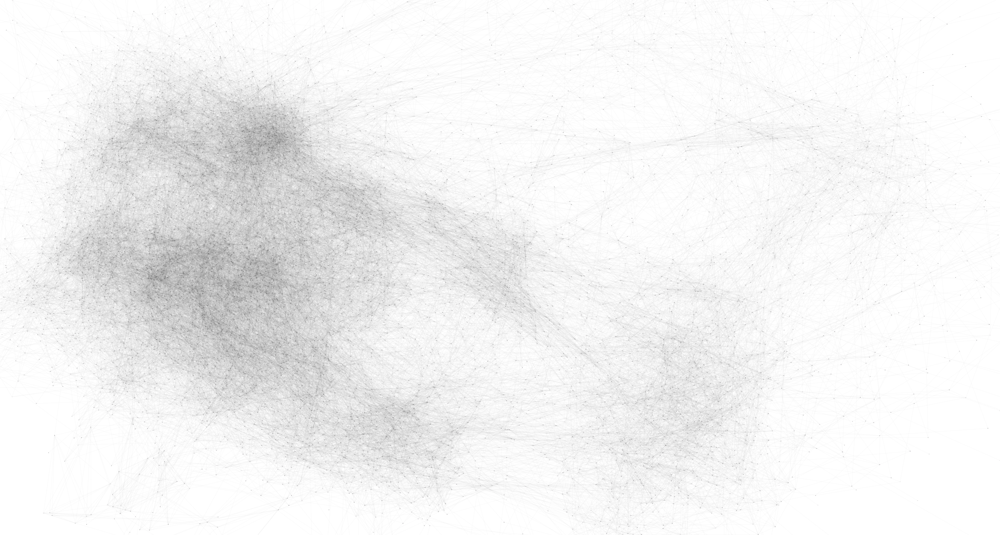

Almost every night my wife and I play [Weaver](https://wordwormdormdork.com/) together. It's always fun after
several nights not finding the shortest "optimal" sequence of words it got me
thinking. "How hard could it be to write an optimal Weaver solver?"

So I made one. Here's how I did it.


## Step 1: Getting the Weaver lexicon

Weaver is based around finding a sequence of 4 letter words that each differ
by one letter and lead to some final word.

The obvious first step to making a Weaver solver is to get all English 4
letter words!

I started by downloading an [English dictionary on GH](https://github.com/dwyl/english-words) and filtered out all non
4 letter words.

```bash
wget https://github.com/dwyl/english-words/raw/master/words_alpha.txt -O /tmp/words.txt
awk '{ if (length($0) == 5 ) print }' /tmp/words.txt | uniq > /tmp/4words.txt
wc -l /tmp/4words.txt
```

```text
7186 /tmp/4words.txt
```

We see here that our lexicon is `7186` words.


## Step 2: Building the Weaver graph

The next step is to build a representation of the Weaver "solution space" that
we can work with to enable us to find the shortest word path.

The simplest representation I could think of is a graph where the nodes are
the words, and the edges link words that have a 1 letter difference.

This representation is convenient because once we make it, we can run a
shortest path graph algorithm (like Djikstra's) to get the optimal word path.

```python
def is_distance_one(word1, word2):
    """If the words share 3 letters, they are distsance one"""
    word1 = set((i, w) for i, w in enumerate(word1))
    word2 = set((i, w) for i, w in enumerate(word2))
    return len(set(word1).intersection(set(word2))) == 3

weaver_graph = {}
with open('/tmp/4words.txt', 'r') as four_words:
    for new_word in map(lambda w:w.strip(),four_words):
        weaver_graph[new_word] = []
        for existing_word, possible_next_words in weaver_graph.items():
            if is_distance_one(new_word, existing_word):
                weaver_graph[new_word].append(existing_word)
                weaver_graph[existing_word].append(new_word)

import json
with open("/tmp/weaver_graph.json","w+") as f:
    f.write(json.dumps(weaver_graph))
```

This is a naive algorithm to create the graph, but it's simple, to the point,
and we only have to run it once.

Now that the graph is built, let's try visualizing it!



This picture doesn't tell us much besides dense vs. not dense, but it's a
pretty picture nonetheless!

<p>
If you want explore the graph for yourself,<a href="/img/weaver_graph.json"> here is the JSON blob</a> and
<a href="/img/weaver_graph.svg"> here is the SVG viz</a>.
</p>


## Step 3: Building the Weaver solver!

Now that we have a graph of all the Weaver words and the transitions between
them, all we have left to do is build a solver!

As mentioned we can now use a Djikstra's shortest path algorithm to find our
optimal solution!

```python
import json
import heapq
from collections import namedtuple
from dataclasses import dataclass

@dataclass
class QueueItem:
    node: str
    path: list[str]
    cost: int = 1

    def __lt__(self, other):
        return self.cost < other.cost

class WeaverSolver:
    def __init__(self, weaver_graph_path: str):
        self.weaver_graph = json.loads(open(weaver_graph_path,"r").read())

    def solve(self, start_word: str, end_word: str, avoid_words: list[str] = None) -> list[str]:
        assert start_word in self.weaver_graph, f"Start word {start_word} not in graph"
        assert end_word in self.weaver_graph, f"End word {end_word} not in graph"

        if not avoid_words:
            avoid_words = []

        init_queue_item = QueueItem(node=start_word, path=[], cost=0)
        queue = [init_queue_item]
        seen = set()

        while True:
            qi = heapq.heappop(queue)
            if qi.node not in seen:

                qi.path = qi.path + [qi.node]
                seen.add(qi.node)

                # if we are at the end, return the path
                if qi.node == end_word:
                    return qi.path

                # search edges avoiding nodes and increasing cost
                for search_node in self.weaver_graph[qi.node]:
                    cost = float("inf") if search_node in avoid_words else qi.cost + 1
                    heapq.heappush(
                        queue,
                        QueueItem(
                            node=search_node,
                            path=qi.path,
                            cost=cost,
                        )
                    )

solver = WeaverSolver("/tmp/weaver_graph.json")
print(solver.solve("bone", "cast"))
```

```text
['bone', 'bane', 'cane', 'cant', 'cast']
```

And huzzah! We have a Weaver solver!


## [UPDATE] Step 4: Word frequency weights

One problem I noticed with this solver is that sometimes the word path chosen
won't get accepted by Weaver. To try and remedy this without Weaver's word
list I decided to try and "weight" the graph edges based on word frequency.

First I got a frequency list of english words by usage

```bash
wget https://github.com/nachocab/words-by-frequency/raw/master/english.txt -O /tmp/words_freq.txt
awk '{if(length($2)==4){print $2, $1}}' /tmp/words_freq.txt | tr " " "," > /tmp/4words_freq.csv
cat /tmp/4words_freq.csv | python3 -c 'import json,sys,pandas;print(json.dumps(pandas.read_csv(sys.stdin,header=None).set_index(0).to_dict()[1]))' | jq -r > /tmp/4words_freq.json
```

Then I adjusted the code we had before except added a "likeness" factor to
make edges whose words are more popular slightly less expensive to traverse.

While it adds a hyperparamater to tune how "closely" we follow this frequency
list, it makes us much more likely to get a path accepted by Weaver.

```python
import json
import heapq
from collections import namedtuple
from dataclasses import dataclass

@dataclass
class QueueItem:
    node: str
    path: list[str]
    cost: int = 1

    def __lt__(self, other):
        return self.cost < other.cost

class WeaverSolver:
    def __init__(self, weaver_graph_path: str, word_freq: str = "", freq_likeness: int = 5):
        self.weaver_graph = json.loads(open(weaver_graph_path,"r").read())

        try:
            self.word_freq = json.loads(open(word_freq,"r").read())
        except:
            self.word_freq = {}

        self.freq_likeness = freq_likeness

    def solve(self, start_word: str, end_word: str, avoid_words: list[str] = None) -> list[str]:
        assert start_word in self.weaver_graph, f"Start word {start_word} not in graph"
        assert end_word in self.weaver_graph, f"End word {end_word} not in graph"

        if not avoid_words:
            avoid_words = []

        init_queue_item = QueueItem(node=start_word, path=[], cost=0)
        queue = [init_queue_item]
        seen = set()

        while True:
            qi = heapq.heappop(queue)
            if qi.node not in seen:

                qi.path = qi.path + [qi.node]
                seen.add(qi.node)

                # if we are at the end, return the path
                if qi.node == end_word:
                    return qi.path

                # search edges avoiding nodes and increasing cost
                for search_node in self.weaver_graph[qi.node]:
                    cost = 1
                    if search_node in avoid_words:
                        cost = float("inf")
                    elif search_node in self.word_freq:
                        cost = qi.cost + 1 - (self.word_freq[search_node] / (self.freq_likeness*self.word_freq[search_node]+1))
                    else:
                        cost = qi.cost + 1
                    heapq.heappush(
                        queue,
                        QueueItem(
                            node=search_node,
                            path=qi.path,
                            cost=cost,
                        )
                    )

solver = WeaverSolver(weaver_graph_path="/tmp/weaver_graph.json", word_freq="/tmp/4words_freq.json", freq_likeness=5)
print(solver.solve("snow", "days"))
```

```text
['snow', 'snot', 'soot', 'boot', 'boos', 'boys', 'bays', 'days']
```

Thanks for reading! ヾ(⌐■_■)ノ♪
