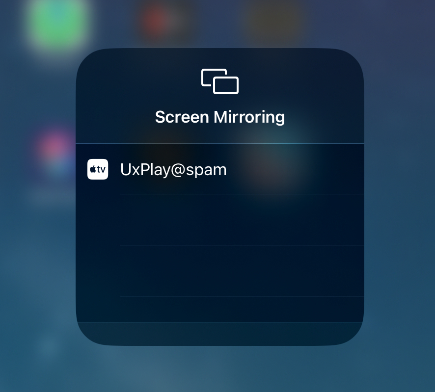

Recently I bought an iPad so I can live share my notes to my laptop during
screencasts. This is incredibly useful for online meetings, presentations, or
pair programming sessions where I want to show notes to whoever in real-time.

In this blog post, I'll explain how I setup screen mirroring from my iPad to a
NixOS based setup. Whether you are using NixOS as your daily driver or just want
to try out screen mirroring on a \*nix based system, hopefully my experience and
learnings can be helpful for you.


## Prerequisites

1.  An iPad with screen mirroring capabilities.
2.  A laptop or desktop computer running [NixOS](https://nixos.org/).
3.  Both devices connected to the same local network

Note that for the rest of this tutorial I'm running NixOS 22.11 (Raccoon) and
an iPad (6th gen) running iOS 16.2.


## Setting up an AirPlay receiver on NixOS

Apple devices canonically talk to each other via [AirPlay](https://www.apple.com/airplay/), so in order to
mirror an iPad to NixOS, we need to setup an AirPlay "receiver" server.

There are many open source AirPlay receivers, but I chose to use [UxPlay](https://github.com/FDH2/UxPlay) simply
because it was the first one I came across and it's in `nixpkgs`.

Now unfortunately if we start running the receiver via `nix run
  nixpkgs#uxplay`, the iPad won't see anything 😓. This is expected though
because the receiver has no way of interacting with the [service discover](https://openairplay.github.io/airplay-spec/service_discovery.html)
mechanism of AirPlay which is mDNS.

The UxPlay README recommends using [Avahi](https://github.com/lathiat/avahi) for doing mDNS. Luckily [Avahi is
available for NixOS](https://github.com/NixOS/nixpkgs/blob/release-22.11/nixos/modules/services/networking/avahi-daemon.nix) so we can add it too our `configuration.nix` as follows:

```nix
services.avahi = {
  nssmdns = true;
  enable = true;
  publish = {
    enable = true;
    userServices = true;
    domain = true;
  };
};
```

Now after a `nixos-rebuild switch` we should be running Avahi

```text
$ systemctl status avahi-daemon.service
* avahi-daemon.service - Avahi mDNS/DNS-SD Stack
     Loaded: loaded (/etc/systemd/system/avahi-daemon.service; enabled; preset: enabled)
     Active: active (running) since Tue 2022-12-27 09:12:57 EST; 13s ago
TriggeredBy: * avahi-daemon.socket
   Main PID: 245105 (avahi-daemon)
     Status: "Server startup complete."
         IP: 8.8K in, 8.8K out
         IO: 0B read, 0B written
      Tasks: 1 (limit: 38114)
     Memory: 628.0K
        CPU: 22ms
     CGroup: /system.slice/avahi-daemon.service
             `-245105 "avahi-daemon: running [spam.local]"

Dec 27 09:12:57 spam avahi-daemon[245105]: New relevant interface lo.IPv4 for mDNS.
Dec 27 09:12:57 spam avahi-daemon[245105]: Network interface enumeration completed.
...
```

Now if we try running UxPlay again, we should see our AirPlay receiver show up
in the screen mirror.



This is great! However if we try to connect we will just end up with a
timeout. What gives?

After breaking out Wireshark it was obvious that is was a firewall issue. The
simple remedy to this problem was to set `networking.firewall.enable = false;`
in the `configuration.nix`. But this is in general a bad idea and should be
avoided.

Instead I went with a uxplay + iptables + bash approach so while the uxplay is
running, iptables will allow incoming traffic to all necessary ports, and on
exit, will close them again.

```bash
#! /usr/bin/env nix-shell
#! nix-shell --quiet -p uxplay -i bash

set -ueo pipefail

## Clear any existing "DROP ME" rules
## ref: https://stackoverflow.com/a/63855690/12393422
while sudo iptables -L -n --line-number | grep "DROP ME" > /dev/null; do
  sudo iptables -D INPUT $(sudo iptables -L -n --line-number | grep "DROP ME" | head -1 | awk '{print $1}');
done


LOCAL_CIDR=${1:-"192.168.0.0/16"}

open-port-tcp() {
  local port=$1
  echo "Opening tcp port $port from $LOCAL_CIDR ..."
  sudo iptables \
       -I INPUT \
       -p tcp \
       -s $LOCAL_CIDR \
       --dport $port \
       -j ACCEPT \
       -m comment --comment "DROP ME"
}

close-port-tcp() {
  local port=${1:-0}
  echo "Closing tcp port $port from $LOCAL_CIDR ..."
  sudo iptables \
       -D INPUT \
       -p tcp \
       -s $LOCAL_CIDR \
       --dport $port \
       -j ACCEPT \
       -m comment --comment "DROP ME"
}

open-port-udp() {
  local port=$1
  echo "Opening udp port $port from $LOCAL_CIDR ..."
  sudo iptables \
       -I INPUT \
       -p udp \
       -s $LOCAL_CIDR \
       --dport $port \
       -j ACCEPT \
       -m comment --comment "DROP ME"
}

close-port-udp() {
  local port=${1:-0}
  echo "Closing udp port $port from $LOCAL_CIDR ..."
  sudo iptables \
       -D INPUT \
       -p udp \
       -s $LOCAL_CIDR \
       --dport $port \
       -j ACCEPT \
       -m comment --comment "DROP ME"
}

open-port-tcp 7100
open-port-tcp 7000
open-port-tcp 7001
open-port-udp 6000
open-port-udp 6001
open-port-udp 7011

# Ensure port closes if error occurs.
trap "close-port-tcp 7100 && \
      close-port-tcp 7000 && \
      close-port-tcp 7001 && \
      close-port-udp 6000 && \
      close-port-udp 6001 && \
      close-port-udp 7011
      " EXIT

uxplay -p

```

```sh
$ ipad_screen_mirror_server
Opening tcp port 7100 from 192.168.0.0/16 ...
Opening tcp port 7000 from 192.168.0.0/16 ...
Opening tcp port 7001 from 192.168.0.0/16 ...
Opening udp port 6000 from 192.168.0.0/16 ...
Opening udp port 6001 from 192.168.0.0/16 ...
Opening udp port 7011 from 192.168.0.0/16 ...
using network ports UDP 7011 6001 6000 TCP 7100 7000 7001
using system MAC address xx:xx:xx:xx:xx:xx
Initialized server socket(s)
```

Here is the [gist](https://gist.github.com/cmrfrd/fe8f61da076f8a4a751bf8fc8cb579a5) for those interested.

Now wrapping all this code into a simple script gives us an easy way to easily
spin up an AirPlay receiver server!

If you want to learn more about screen mirroring or NixOS, here are some
additional resources you might find helpful:

-   NixOS documentation (<https://nixos.org/manual/>)
-   mDNS RFC (<https://www.rfc-editor.org/rfc/rfc6762.html>)
-   Publish a service with Avahi on NixOS
    (<https://blog.stigok.com/2019/12/09/nixos-avahi-publish-service.html>)
-   OpenAirPlay Spec (<https://openairplay.github.io/airplay-spec/introduction.html>)

I hope you found this useful, let me know if you have any other tips or tricks
for screen mirroring on NixOS!


(ง ͠° ͟ل͜ ͡°)ง
