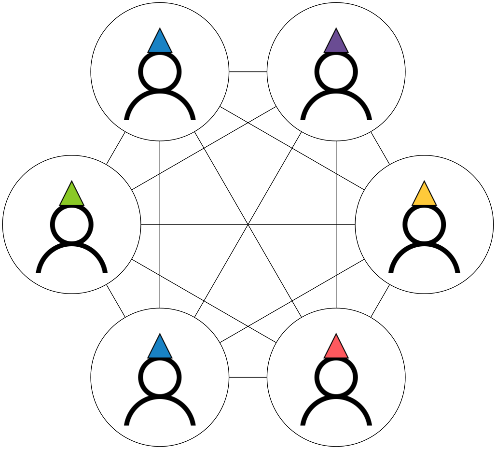
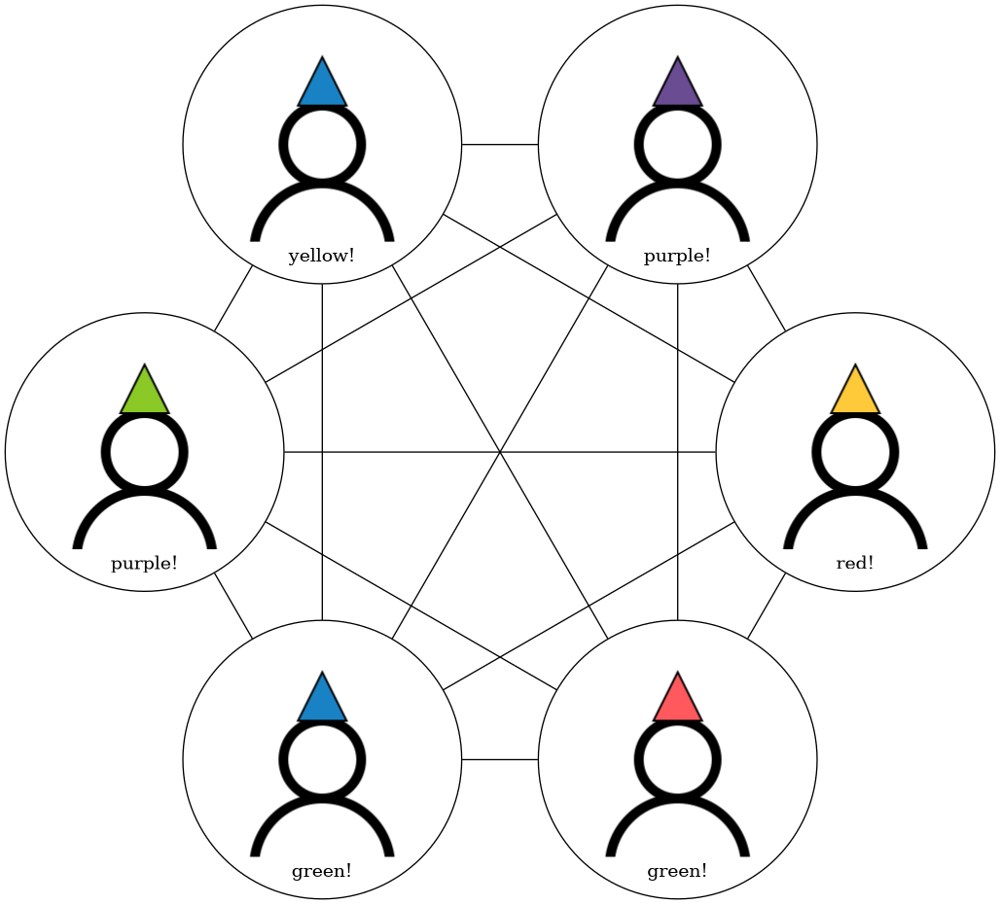

## The puzzle

You and your friends are walking through the park when an evil game master
kidnaps you all and forces you to play a devious game.

The game master sits you all down in a room across from one other and explains
the game. The game master says that he will be placing hats on each of your
heads. Each hat will be one of several colors, the maximum number of possible
colors will match the number of people in your group. So if there are six of
you, there will be six different possible colors that the game master can
choose from. However, the game master is sneaky, and can choose to use as few
or as many colors as he sees fit; some of you could end up wearing the same
color hat. You won't be able to see your own hat, but you **will** be able to
see everybody elses.

Once the game master places all the hats, then one by one he will ask you in
order to write down your best guess as to what your own hat color is. If at
least one of you is able to guess your own hat color, he'll set you all free,
and if not, you all must remain his prisoners!

Feeling merciful, the game master gives you a few moments to say goodbye to
each other as he believes you are all doomed. This gives you a few moments to
think of a way to try and win his devious game. This is important because once
the game master sits you down, you won't be able to communicate at all to each
other without forfeiting the game.

How can you **guarantee** that at least one of you will guess your own hat color
correctly?

## TLDR

Rainbow Hats Puzzle

1.  You and
    $n$ friends are sitting in a room across from one another.
2.  Each of you is wearing a colored hat $c_{i}$.
3.  The number of unique hat colors is equal to $n$.
4.  Colors may or may not repeat.
5.  You can see everyone elses hat color except your own.
6.  No friend can communicate with another once the hats are placed.
7.  No friend can hear any other friends guesses

**Goal:** garuntee that at least one of you can guess their own hat color!

Try to solve it for yourself, or keep scrolling for the answer!

---

## The Solution

This has been one of my favorite math puzzles I've seen over the past year. In
my mind it strikes that beautiful in between of mathematical simplicity, and
hard reasoning. Let's go through that reasoning and the solution step by step:

First lets define some core variables based on the puzzle description

| Variable | Description                                                                              |
|----------|------------------------------------------------------------------------------------------|
| $n$      | The total number of people                                                               |
| $c_{i}$  | The ith colored hat (represented as an integer between 0 and n-1)                        |
| $S_{i}$  | The sum of colored hats seen by person "i", or ${\sum_{j=0}^{n} c_{j}}$ where $j \neq i$ |

The first logical and simplest step is to try and express our desired
$c_{i}$ in an
algebraic form from the perspective of any one of the friends like so:

$$
\begin{alignedat}{2}
T = {\sum_{j=0}^{n} c_{j}} \\ c_{i} = -S_{i} + T
\end{alignedat}
$$

Here we are expressing $c_{i}$ as the difference between the sum of total colors
in the group
$T$, and the sum of colors any one friend can see
$S_{i}$.

Now the only variable any one of the friends know is $S_{i}$ (since
they can each see each others hats), and since our final goal is to solve for
$c_{i}$, the only
unknown we need to reason about is $T$.

Here we need to make a small leap of insight. The game master by choosing
some combination of colored hats, also decides the value $T$ which is bounded by
$\left[0, {\left(n - 1\right)} n\right]$. $T$
is tricky to understand because the game master effectively is able chooses
any number in this bound. So what do we do?  In situations like this where we
have a complicated variable to reason about, it's often advisable to try
breaking it down or representing it as something more digestible with
different constraints to try and make forward progress.

One of the simplest ways to re-represent bounded variables like
$T$ is by turning
it into a linear form like so:

$$
\begin{alignedat}{2}
\\
\\ T = a n + b
\end{alignedat}
$$

for some a and b with the following constraints: $b \geq 0 , b < n , a \geq 0 , a < n , T \leq {\left(n - 1\right)} n$. In this form, no matter
what value $T$ is,
there will always exist a unique a and b equal to that total.

Substitute everything together, we get:

$$
\begin{alignedat}{2}
c_{i} = a n - S_{i} + b
\end{alignedat}
$$

It might seem like we've gone backwards by adding two more "unknowns" to our
equation, but by doing this we've added more ways to tackle our problem and
integrate new information to help us solve it.

At this point we need to make **yet another** small leap of insight. Mentioned
in puzzle definition is the variable $i$ which tells us that all of the friends have an
order, or an "id". This is information we can use!

If we look closely, since every friend has a unique $i$, this means that no matter what
$T$ the game
master chooses, if we represent $T$ in the linear form, exactly `one` of the friends
will have an $i$
that is equal to $b$ (since $b$ will be bounded from $0$ to $n - 1$). Knowing this we can do the following
cancellation:

$$
\begin{alignedat}{2}
c_{i} = a n - S_{i} + b \\ c_{i} - i = a n - S_{i} + b - i \\ c_{i} - i = a n - S_{i} \\ c_{i} = a n - S_{i} + i
\end{alignedat}
$$

And almost like magic, we've substituted one of our unknown terms
$b$ with a term we
do know, $i$.

This leads us to **one last piece** of insight we need to make to get our final
answer. We know $c_{i}$ is bounded by $\left[0, n - 1\right]$, which means if we apply $\mod n$, it will have no
effect. However if we apply it to both sides, we will actually be able to
eliminate the $a n$ term entirely (because any multiple of
$n$ is just 0 in
$\mod n$).

By applying this operation we get our final expression:

$$
\begin{alignedat}{2}
c_{i} = a n - S_{i} + i \\ c_{i} \mod n = a n - S_{i} + i \mod n \\ c_{i} = -S_{i} + i \mod n
\end{alignedat}
$$

And we've arrived at an interesting conclusion! In order to get a single
friend to guess their own color, all we have to do is have each friend take
their index, subtract the sum of the colors they see, and mod by $n$! In
doing this we guarantee that one of the friends will correctly guess their
own hat!

In this final form, all any friend has to do is:

$$
\begin{alignedat}{2}
-S_{i} + i \mod n
\end{alignedat}
$$

And one will guess correctly!

Congratulations! The game master, stupefied that one of you was able to
guess correctly, begrudgingly releases you!

Thanks for reading! (◍＞◡＜◍)⋈。✧♡
