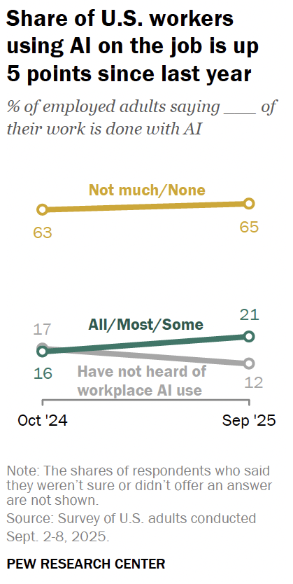
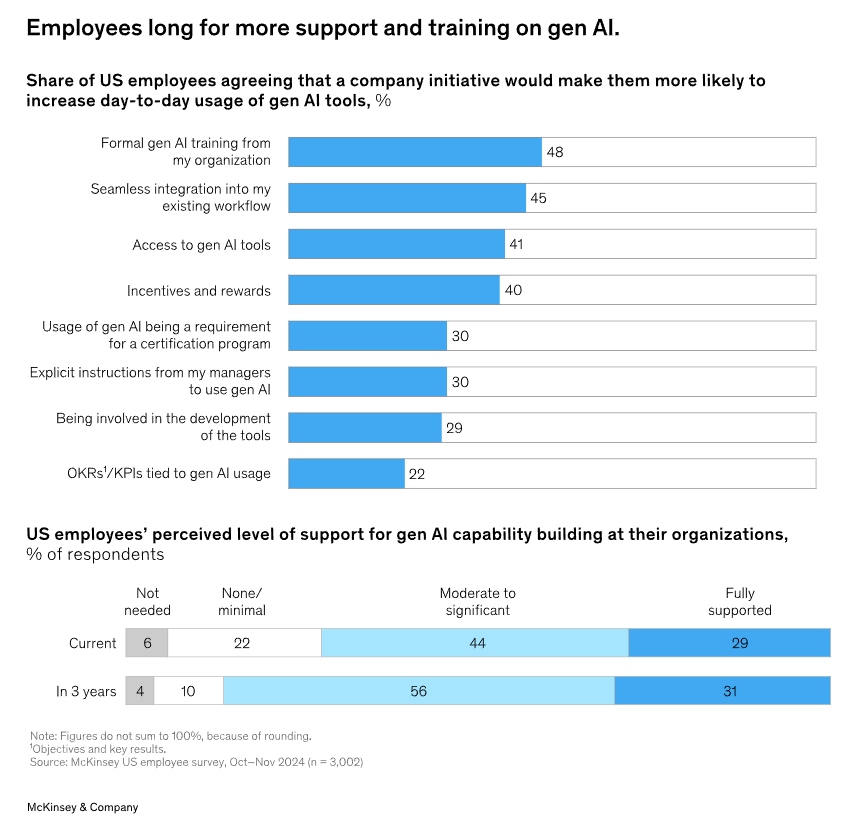

:REVEAL_PROPERTIES:
#+REVEAL_ROOT: https://cdn.jsdelivr.net/npm/reveal.js
#+REVEAL_REVEAL_JS_VERSION: 4
#+REVEAL_TRANS: slide
#+REVEAL_THEME: moon
#+REVEAL_PLUGINS: (highlight markdown)
#+REVEAL_INIT_OPTIONS: slideNumber:false
#+OPTIONS: toc:nil timestamp:nil num:nil
:END:

#+MACRO: color @@html:$2@@
#+MACRO: imglink @@html:@@

#+Title: Using AI as an internal tool
#+Author: Alex Comerford

#+BEGIN_SRC emacs-lisp :exports none
(require 'ox-reveal)
(setq org-src-preserve-indentation nil)
(setq org-toggle-with-inline-images t)
(setq org-edit-src-content-indentation 0)
(setq org-startup-with-inline-images t)
(setq org-export-with-email t)
(setq org-reveal-root "http://cdn.jsdelivr.net/npm/reveal.js")

(defun* export-on-save (&key (enable nil))
  (interactive)
  (if (and (not enable) (memq 'org-reveal-export-to-html after-save-hook))
      (progn
        (remove-hook 'after-save-hook 'org-reveal-export-to-html t)
        (message "Disabled export on save"))
    (add-hook 'after-save-hook 'org-reveal-export-to-html nil t)
    (message "Enabled export on save")))
(export-on-save)
#+END_SRC

#+RESULTS:
: Enabled export on save

* About me

  - ML Engineer
  - Based in Miami 🌴
  - 💙 Infrastructure, ML, and Cryptography
  - 💙💙 Math Puzzles
  - 💙💙💙 Juggling & Fidget Toys

* Goals of this presentation

  - AI isn’t just customer facing; it improves how we work
  - Internal tools unlock real company value
  - MCP bridges AI and non-AI workflows
  - Demo!

* More people are using AI at work

  

* Employees want to use AI at work

  

* Solving Data Access Challenges

  - Businesses often struggle to access internal data quickly and securely.
  - Unblocking employees with self-serving tools gives:
    1. Faster time to answer
    2. Frees up data teams to focus on higher-value work
    3. Encourages a more data-driven culture

* Standardizing Internal AI tooling

  - The standard for internal AI tooling is MCP connectors + LLM Frontends
  - Many connectors exist for common apps (Figma, Gmail, etc.)
  - Every company should have an MCP connector

* Demo!

* Scenario

  We are the BI team for a fake NY based business "Noah's Market"

  - A traditional brick-and-mortar store
  - Sells a hodgepodge set of items
  - We are given exclusive access to their MCP data connector

* Links

  [[https://www.mckinsey.com/capabilities/mckinsey-digital/our-insights/superagency-in-the-workplace-empowering-people-to-unlock-ais-full-potential-at-work#/][Superagency in the workplace]]

  [[https://www.pewresearch.org/short-reads/2025/10/06/about-1-in-5-us-workers-now-use-ai-in-their-job-up-since-last-year/sr_25-10-06_ai-and-work_1/][Pew Research on AI in the workplace]]
